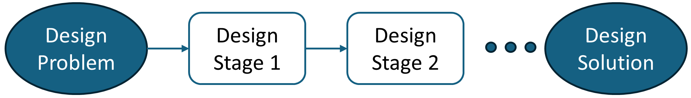
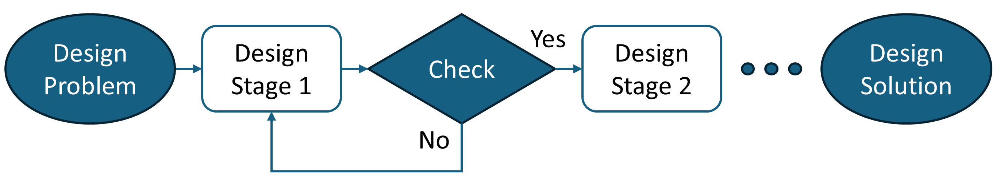
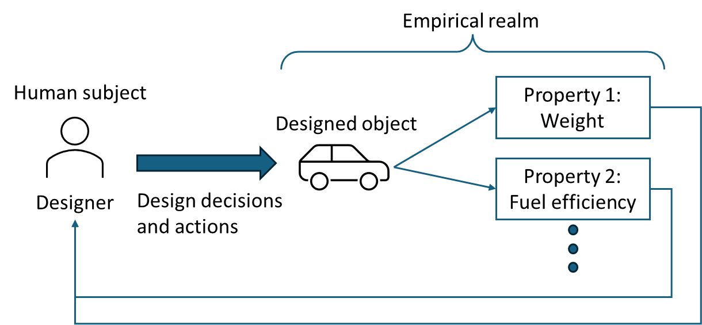
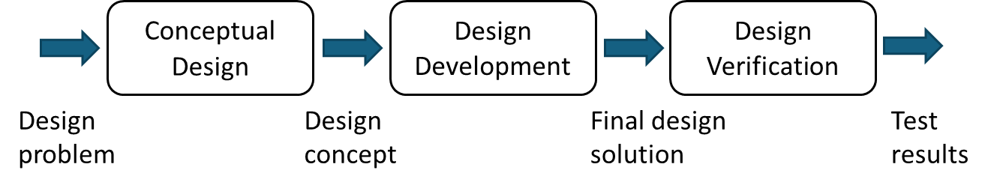
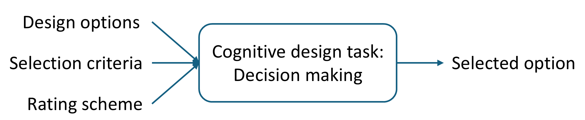
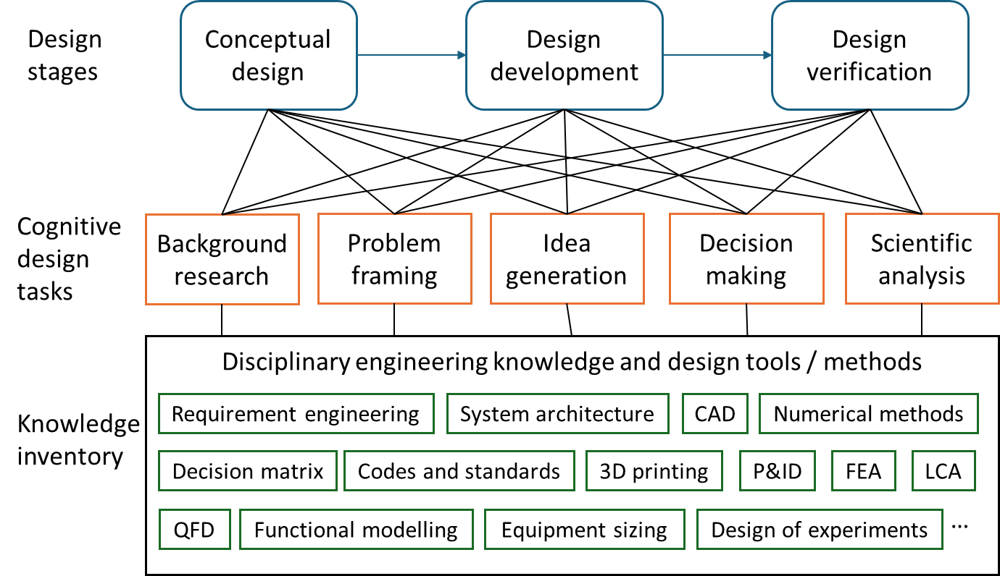

# Chapter 1: Introduction

## 1.1: What is engineering design?

!!! abstract "Definition"
    **Engineering design** is a process that develops synthetic solution(s) using scientific and engineering knowledge to solve a given problem.

Let us unpack this definition and explain each element.

### **Design is a process.**

A design process has a start point and is expected to have an end point. Figure 1 illustrates a conception of a linear process. Starting with a design problem, a designer often needs to go through multiple stages before they complete a design solution.

_Figure 1. Conception of a linear process_

### **Design process often proceeds iteratively rather than linearly.**

Figure 2 illustrates an example. After Design Stage 1, the results are checked. Since the results are not "good enough," the designer needs to go back to Design Stage 1 to improve the results before proceeding to Design Stage 2.

_Figure 2. Conception of an iterative process_

Design iteration is very common because we cannot predict the design outcomes with 100% accuracy. We often need to try out an idea, test it and then improve it. Thus, design iteration should not be perceived as a deficiency.

Of course, uncontrolled and undisciplined design iteration is not good, as this practice can lead to undesirable design outcomes by the end of the design project. This aspect will be discussed in the chapter of [project management](chapter_5_project_management/).

### **Engineering design is about problem solving.**

In capstone projects, design problems are given by project sponsors (or clients). While these problems may not be clearly articulated initially, how well we can solve their problems is an important perspective for us to evaluate the quality of design solutions and the ability of designers.

### **Engineering design involves scientific and engineering knowledge.**

Scientific knowledge is associated with the content of natural, engineering, and mathematical sciences, which are considered as foundational knowledge for engineers (e.g., statics, calculus, electricity, chemical reactions, thermodynamics). Engineering knowledge can be associated with the content of engineering tools and practices (e.g., computer programming, 3D modeling, codes and standards, instrumentations, prototyping tools).

The involvement of scientific and engineering knowledge can effectively differentiate engineering design from other types of design (e.g., paintings and fashion design).

Under the "applied science" culture, it is often perceived that good technical skills and knowledge will lead to good design work. From our experience, it is not entirely true. A design team can list and explain a lot of technical content flawlessly without solving the given problem directly. Correct scientific and engineering knowledge is necessary but not most essential in the delivery of good design solutions.

### **Design yields synthetic solution(s).**

In engineering design, we can classify two types of solutions: analytical and synthetic. 

!!! abstract "Definition"
    **Analytical solutions** try to determine the properties of the designed object.

See Figure 3 below. The designer can perform engineering analysis to find analytical solutions such as the properties of a car (e.g., weight, fuel efficiency). The term "empirical realm" in the figure means that analytical solutions can be examined and verified on an objective ground (primarily using scientific and engineering knowledge).

!!! abstract "Definition"
    **Synthetic solutions** are related to the decisions and actions by the designer, who determines the content of the design solution (i.e., the designed object in Figure 3).

The formation of synthetic solutions requires the designer to understand the design problem and formulate a possible solution(s) in their mind. When the synthetic solution is ready, the designer communicates the "designed" object (e.g., on a paper), which can be evaluated under the empirical realm.

_Figure 3. Analytical and synthetic solutions_

!!! note "Analytical versus Synthetic Solutions"
    In a design project, it is important to identify the designed object (or synthetic solutions) without confusing it with analytical solutions. As the concept of designed object can be difficult, let us give more examples.

!!! example "Example: Designed object"
    Consider a team that plans to conduct a life-cycle analysis (LCA) for a refinery plant. Strictly speaking, this team is not working on a design problem since they will not make any decisions over the refinery plant and may primarily follow existing LCA procedures. However, if the team plans to develop new LCA procedures for the existing refinery plant, it becomes a design problem (where the new LCA procedures are the designed object). Table 1 suggests some more examples of designed objects and related properties in different engineering domains.

_Table 1. Examples of designed objects and related properties_

| Discipline | Context                                                           | Designed object                                                    | Property                                                                  |
| ---------- | ----------------------------------------------------------------- | ------------------------------------------------------------------ | ------------------------------------------------------------------------- |
| Biomedical | Design of a low-cost prothesis                                    | Prothesis                                                          | Weight, functionality, fitting comfort, user acceptance                   |
| Chemical   | Design of a wastewater treatment process                          | Treatment process (or plant)                                       | Quality of treated water, energy efficiency, capital cost, operating cost |
| Civil      | Improvement of traffic congestion of a shopping mall              | Traffic arrangement (e.g., routes, signs)                          | Average wait time in congestion, safety, implementation cost              |
| Electrical | Development of a monitoring system for a large agricultural field | Monitoring system                                                  | Data reliability and accuracy, energy efficiency, implementation cost     |
| Mechanical | Investigation of flex wing under airflow                          | (1) New investigation method (2) Control mechanism over flex wing  | (1) Cost, accuracy, usability (2) Fluid mechanics properties              |

## 1.2: Why do we have capstone design projects?

Capstone design projects are referred to as final-year projects, from which students are expected to apply their knowledge and skills learned from their engineering programs and develop design solutions. Capstone design projects are intended to help students develop practical design skills for real-world engineering projects. To achieve this educational purpose, capstone design projects have some common features that are shared with real-world projects. Three common features are discussed below to explain how capstone projects are intended to support students to develop technical and professional skills.

### **Feature 1: Capstone projects involve ill-defined problems.**

Ill-defined problems initially contain incomplete information for problem solving, where designers are expected to learn the initial problems through background research and discussions with clients (and/or end users). Designers often need to make assumptions so that they can work on decision-making and analysis problems. Ill-defined problems can be contrasted to well-defined textbook problems, which provide complete information (i.e., no need to make assumptions) and seek for "the correct" answers.

_Why are ill-defined problems common in engineering projects?_ There are at least two reasons. First, it takes a lot of efforts to write a well-defined problem (it may be why textbooks charge us for well-defined problems). Thus, it is common for problem-providers to express their needs at a high level, and they expect problem-solvers to explore more and refine the details of the design problems.

Second, while it sounds ironic, problem-providers may not know what they want exactly at the beginning, thus making the original problem statements ill-defined. Through background research and discussions, one duty of problem-solvers is to help problem-providers to refine the scope of the design work.

### **Feature 2: Capstone projects require critical thinking.**

Critical thinking controls how technical content should be applied in engineering and design work, and such skills are needed in both capstone and real-world projects. Suppose that I have learned different categories of engineering materials and their properties (technical content) from a technical course. Capstone projects can provide me an authentic context, from which I need to deliberate how to connect material properties to the design needs (or requirements). Further, after developing a design solution in a capstone project, critical thinking is also needed to verify how well the design solution would work.

_Do we need critical thinking in professional practice?_ Absolutely. Engineering projects often face conflicting expectations (e.g., good-enough versus high-performing solutions) with a wide range of considerations (e.g., codes and standards, environmental and social aspects). Critical thinking is most needed for designers to navigate and develop design solutions in a complex world. Before facing these real-world challenges, capstone projects are expected to provide a reasonable level of complexity, from which students can practice and reflect on their critical thinking.

### **Feature 3: Capstone projects offer practices in teamwork, technical communication, and project management.**

The need for teamwork, technical communication, and project management is evident in engineering practice. An open question is how capstone projects can provide training on these professional skills. For teamwork, students are expected to work with their teammates and achieve a common project's goal. For technical communication, students are
expected to communicate the design content to different types of audience such as academic advisors, industry sponsors, and potentially, the public. For project management, students need to define and follow their own project's timeline and keep track of the project's progress.

!!! note
    Capstone projects provide an intermediate platform between a controlled school environment and an authentic workplace, where students can develop and reflect on their professional skills for future engineering careers.

!!! warning "Limitations of capstone projects"
    However, we should not treat capstone projects as equivalent to real-world projects, since capstone projects have their unique elements (in contrast to typical real-world projects). Listed below are some examples of unique elements.
    
    - **Capstone design projects are administered in a school environment**, where some school-specific elements remain (e.g., coursework requirements and grading). These school-specific elements are not common in real-world projects, and they can affect how students approach capstone projects.
    
    - **Capstone design projects have a fixed timeline** (e.g., duration of 7-8 months, begin in early September and finish by mid April of next year). Real-world engineering projects can be delayed (somehow unfortunate but real situations).
    
    - **Capstone design projects do not have the employer-employee relationships**, which are common in real-world projects. Employer-employee relationships confine the power and duty structures of a design team, and they can faciliate the project execution more smoothly. In contrast, capstone projects often require the design team to define their own working structure, and team members are not paid for their project work.

## 1.3: Capstone design process

Generally, we can organize a capstone design process into three stages: conceptual design, design development, and design verification. Figure 4 shows the workflow of these design stages with typical input and output information.

_Figure 4. Three-stage engineering design process_

To illustrate the ideas of design stages, we use two examples:

- Example 1: Design a HVAC system for a school.
- Example 2: Design an autonomous snow removal device.

### Conceptual design

The purpose of conceptual design is to develop a tentative solution (or a design concept) that can be used to solve the design problem in principle. Compared to the next stage (i.e., design development), the results of conceptual design represent the major design decisions that cannot be changed easily during the project.

!!! example "Example 1: Design a HVAC system for a school"
    Major decisions include centralized or decentralized systems, zoning, and all-air and hydronic systems. Suppose that the design team has decided on using a hydronic system for heat distribution. It is  difficult to reverse this decision after a team member has completed the sizing of the hydronic system.

!!! example "Example 2: Design an autonomous snow removal system"
    Major decisions include the power source (gas or electricity) and the snow removal mechanism (e.g., push versus scoop-and-throw). The design details between the push and scoop-and-throw mechanisms are very different, where the design team likely needs to commit on one idea. Of course, if the time and resources allow, the design team can develop both ideas at the same time (but it is not like to happen due to the time constraint of capstone projects).

### Design development

The purpose of design development is to develop design details for a design concept (i.e., to complete the design solution) so that the design solution can be examined through scientific and experimental means. This design stage often involves technical knowledge and skills that students learn from their engineering programs.

!!! example "Example 1: Design a HVAC system for a school"
    Suppose that an all-air system is selected from the conceptual design stage. One part of work is to size the components of the air handling unit (AHU) to satisfy the heating, cooling and ventilation requirements.

!!! example "Design an autonomous snow removal system"
    Suppose that the push mechanism is selected from the conceptual design stage to move snow from the ground. One part of work is to design the mechanical components for the push mechanism, along with the sizing of the motor.

### Design verification

The purpose of design verification is to examine how well the design solution work. Instead of relying on verbal arguments (e.g., I think our design solution is good), this design stage focuses on collecting observable evidence to evaluate the performance of the design solution.

!!! example "Example 1: Design a HVAC system for a school"
    The design solution is simulated through EnergyPlus, where the results of energy consumption and carbon emissions are compared with industry benchmarks.

!!! example "Example 2: Design an autonomous snow removal system"
    The push mechanism is tested physically with 3-cm depth of snow with wired control. The results of cleaning time and "cleanness" are measured and compared with the manual approach.

## 1.4: Cognitive design tasks

Cognitive design task can be perceived as a unit of design work, where designers focus on how to process information and yield outcomes meaningfully for a design project. For example, a designer can work a decision-making task to compare and select the snow removal mechanism (e.g., push versus scoop-and-throw). This decision-making task can be considered as one unit of work for this designer in the design project.

Engineering design is an information-intensive process. The purpose of cognitive design tasks is to decompose design activities into a set of tangible and workable tasks, where designers can focus on the input information and the expected outcomes. Figure 5 illustrates a sample structure of a cognitive design task of decision making, where the designer collects the information of (1) design options, (2) selection criteria, and (3) rating scheme, and the expected outcome is the selected option. Through the execution of cognitive design tasks, designers develop meaningful content for the design project.

_Figure 5. Information flow of a cognitive design task_

For capstone design projects, we can generally classify five types of cognitive design tasks, which are briefly defined in Table 2. Cognitive design tasks can be used to articulate the required design information for each of the design stages.

_Table 2: Five types of cognitive design tasks_

| Cognitive design tasks | Description |
|------------------------|-------------------------------------------------------|
| Background research    | Learn and analyze new information for the design work |
| Problem framing        | Define the problem’s scope and formulate workable design tasks |
| Idea generation        | Propose new design ideas and develop design details |
| Decision making        | Formulate decision-making problems and make the final choice |
| Scientific analysis    | Analyze design solutions with scientific properties |

Combining the three design stages (Figure 4) and the five types of cognitive design tasks (Table 2), students can deliberate how to apply their knowledge meaningfully through cognitive design tasks and contribute to each design stage. Figure 6 provides a three-layer framework to illustrate this idea. The first layer outlines a design process of three design stages. In each design stage, designers can conduct different types of cognitive design tasks (second layer). Designers can utilize their knowledge inventory (third layer) to support the execution of cognitive design tasks.

_Figure 6. Cognitive design tasks and a three-layer framework_

The notion of cognitive design tasks can be abstract, and more examples will be provided in the following chapters. The function of cognitive design tasks is to provide a platform for designers to conceptualize the problem's situation and integrate their knowledge and skills for the design project. Yet, the platform itself does not prescribe how to design; it provides a classification that can guide designers to identify what information can be meaningful for a design project.
