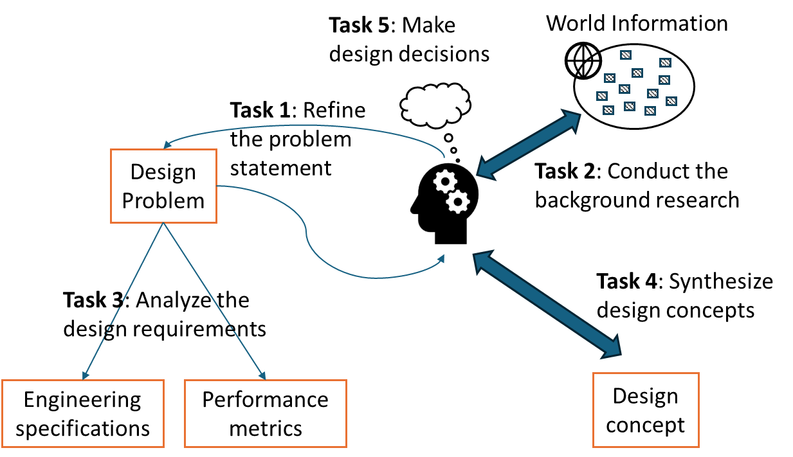

# Chapter 2: Conceptual Design

## 2.1: Why bother conceptual design?

**Why do we have a stage of conceptual design? Can we just do the "real design work" directly?**

The answer is YES. Indeed, we can do the "real design work" directly by skipping conceptual design. Yet, proficiency in conceptual design can differentiate whether a capstone design project is managed as a craftsman or hobbyist project[^1] or as a project that is close to the real-world practice. In view of design education, conceptual design can support students to develop the following skills.

- Communicate design ideas with stakeholders before major commitment of time and effort.
- Anticipate how design ideas may work before building or implementing these ideas.
- Clarify the technical requirements and estimate the technical feasibility at an early project stage.
- Explore different ideas and establish a buy-in (or approval) among team members and stakeholders.

**Conceptual design is the most important stage in the design process.** Why? Once a design concept (or idea) is committed, a lot of design efforts will be based on it, and any further changes to the concept will be difficult and costly.

!!! example "Example: Why conceptual design is important?"
    
    Suppose that a manufacturer is considering developing next-generation green vehicles. They only have resources to develop one line of products, and they have to decide on either using (a) electrical system or (b) hybrid system for the energy source. Suppose that the manufacturer decides on the electrical system. Then, the subsequent efforts will be designing battery, electric motor, etc. If the manufacturer regrets on using the electrical system after one year of development, all the relevant design efforts would probably be wasted (e.g., the research of battery can become irrelevant).

Though conceptual design is important in practice, students do not need to aim for a "perfect" design solution before moving on to do the next stage of design work. Even experienced designers in the field cannot be sure about "perfect" solutions. A "good enough" design concept by the design team is sufficient, and it includes two features.

- First, the design concept is feasible and verifiable within the scope of the capstone design course.
- Second, sponsors and clients understand and support the design concept for the next stage of development. Thus, by completing the stage of conceptual design, it is advised to hold a major design review with stakeholders to get their buy-in and detect any possible issues before it is too late.

## 2.2: What is conceptual design?

The purpose of conceptual design is to propose some design concept(s) to resolve the design problem. A design concept is a preliminary design solution that reveals the basic ideas or principles to solve the design problem. A design concept should achieve the following purposes:

- Let the stakeholders understand the general solution approach.
- Define some key decisions, based on which the team can invest (substantial) effort to develop the design details.

Let me use two examples to explain what is and what is NOT conceptual design.

!!! example "Example: Design a HVAC system for a school"
    
    In conceptual design, the design team needs to decide on the major systems for heating and cooling (e.g., all-air systems versus hydronic systems) and the key ventilation strategy (e.g., mixed-air or displacement ventilation). Additional conceptual design content may include zoning and the number of major systems (e.g., two heating systems for two different zones?).
    
    Some design work and decisions should not be considered as conceptual design content. Let us consider two examples. First, the selection of the fan for the air handling unit is NOT conceptual design (i.e., the fan sizing problem), as this design work should be considered in the next design stage (i.e., design development). Focusing on the fan selection without knowing the major systems is like selecting a hotel without knowing the destination. It often confuses the discussion in conceptual design, discouraging stakeholders from understanding more essential content.
    
    Second, the layout design of the ductwork is NOT conceptual design if the ventilation strategy has not been decided clearly. The ductwork requirements for mixed-air and displacement strategies are not the same. In addition, once the heating / cooling and ventilation requirements are specified in conceptual design, the layout design of the ductwork is usually quite straightforward (e.g., the design work in design development).

!!! example "Example: Design an autonomous snow removal device"
    
    In conceptual design, the design team needs to decide the snow removal mechanism (e.g., push versus scoop-and-throw) and the electronic control platform (e.g., Arduino versus Raspberry Pi). Additional conceptual design content may include the specifications of the snow-removal capacity (i.e., how much snow the device can remove) and the autonomous features (e.g., how "smart" of the device).
    
    Some design work and decisions should not be considered as conceptual design content. Let us consider two examples. First, the selection of the motor is NOT conceptual design (i.e., the motor sizing problem), as this design work should be considered in the next design stage (i.e., design development). Without knowing the snow removal mechanism, discussing how to select the motor often confuses people since the motor requirements for "push" or "scoop-and-throw" mechanisms are different.
    
    Second, the code development for the autonomous features is NOT conceptual design. If the electronic control platform is unclear, the discussion of code development is not quite relevant. On the other side, if the autonomous features can be well specified in conceptual design, the work of code development is relatively straightforward.

**Why is conceptual design important in this context?**

It is related to the cost of making design changes. During the conceptual design stage, if I want to make a design change (e.g., using "scoop-and-throw" instead of "push" mechanism to remove snow), I can simply make the change on the paper and communicate my change with my teammates and stakeholders. However, if I have already put much effort for the development of "push" mechanism (e.g., calculate the "push" forces and shortlist the stock components from the market), the same design change would make my earlier work related to "push" mechanism irrelevant and useless.

## 2.3: What tasks should I do in conceptual design?

Conceptual design is abstract, and thus it is not clear what tasks the design team should work on in this design stage. Traditional design textbooks provide various advice and methods to support concept generation (e.g., morphological chart) and concept selection (e.g., decision matrix). These are good content, which can be considered as "knowledge inventory" (see Figure 6 in [Chapter 1.4](../chapter_1_introduction#14-cognitive-design-tasks) for capstone design work.

We can further consider the conceptual design work in view of [cognitive design tasks](../chapter_1_introduction/#14-cognitive-design-tasks). Instead of prescribing procedures for design activities, designers need to make sense of the given design problem and formulate design tasks that can contribute to the resolution of the design problem. Corresponding to five types of
cognitive design tasks, five specific tasks for conceptual design are suggested, and their conceptual relationships are illustrated in Figure 1 below. After the high-level introduction below, these tasks will be further explained in subsequent sections.

_Figure 1. Five cognitive design tasks in conceptual design_

### Task 1: Refine the problem statement

In a typical capstone design context, the project proposal (or problem statement) is given to the design team by the project sponsor (or client). However, it does not mean that the problem statement is "perfect," and it is the duty of the design team to refine the problem statement. Refined problem statements can (1) help establish common understanding between design teams and stakeholders towards the design goals and (2) guide design teams to stay focused on the expected outcomes.

### Task 2: Conduct background research

By working on a design project, it is common that some topics are not familiar to us. Also, design problems and implied solutions are often related to some existing design solutions. Conducting background research can help us learn more topics related to the design problems and understand typical design solutions for similar problems.

### Task 3: Analyze design requirements

Design requirements specify what we expect to see from the design solutions in technical and engineering terms. It demands the design teams to translate "vague" design situations into "concrete" and measurable content (e.g., engineering specifications and performance metrics) that can be tracked by the design teams and stakeholders.

### Task 4: Synthesize design concepts

Creating new design solutions (or concepts) is one noticeable design work. Designers can generate design concepts intuitively or through some methods to support the creative process. Other design tasks are intended to enhance the quality of design concepts.

### Task 5: Make design decisions

Some design decisions can directly impact how the design team is going to develop their design solution. This task demands how readily the design team can identify and then formulate the decision problem appropriately. This practice guides design teams to make decisions in a disciplined manner.

## 2.4: Refine the problem statement (Task 1)

Conceptual design typically starts with a brief description of the problem. In practice, such problem description can be incomplete and even misleading because the problem providers (e.g., project sponsors, clients) may not know exactly what they want at the beginning. Then, the purpose of Task 1 is to refine the problem statement that fits the scope of the timeline, the skillsets of team members and the available resources.

A good problem statement can help the design to stay on track and make meaningful deliverables in the end. It is the duty of the design team to refine the problem statement for their design project. This task is difficult, and we expect some continuing revisions of the problem statement (e.g., the design team can modify the problem statement in the middle of the design process).

To begin, we should have some idea whether we start with a proper problem statement or not. Consider the following two examples.

!!! example "Two sample problem statements"
    
    - Problem statement 1a: Design a HVAC system for a school.
    - Problem statement 2a: Design an autonomous snow removal system that can remove snow from the driveway.

**Are these two problem statements good for capstone projects?**

Generally, these two statements can point to some design directions, but the contexts are vague for tangible project scopes.

In the HVAC example, the problem statement is simply too broad. To refine this problem statement, we can ask the following questions.

- Where is the school? What kind of school is it? How large of the school?

- Why pursuing this design project? Can we simply follow the conventional procedure for designing the HVAC system?

In the snow removal example, while we may see the innovation's value of the design problem, the feasibility for a capstone project is questionable. To refine this problem statement, we can ask the following questions.

- What are the key autonomous features to be expected?

- What is the maximum capacity of snow removal?

While there is no "standard answer" for "perfect" problem statements, we can review the quality of the problem statement in two aspects. First, can the problem statement communicate the design motivation appropriately (e.g., why do we need a new design, can some existing design solve the same problem)? Design motivation reveals the original intent of the design problem, and the original intent is a powerful piece of information to facilitate common understanding among the project sponsors, the design teams and other stakeholders.

Second, can the problem statement communicate the project's scope (or goals) effectively (e.g., what are the desirable features of a successful design, what are the expected deliverables)? This aspect is related to project management. Since capstone projects have a fixed duration, it is important to define clear project's goals and estimate the deliverables by the end of the project. It can also help the design team to stay focused on tangible outcomes from the project.

To demonstrate, we suggest an improved problem statement for the HVAC design below.

!!! example "HVAC example: improved problem statement"

    Design a HVAC system for ABC Primary School in Calgary. The design details are up to the schematic level. Design one unconventional energy saving feature. Verify the final design using simulation.

This refined problem statement is better because:

- We now know the specific school and the location, and the design team can start collecting the basic information (e.g., the building's size, envelope materials and the weather data).

- "Real" HVAC design work takes a lot of efforts (e.g., mechanical drawings, budgeting). Knowing the design scope up to the schematic level can help the design team to develop reasonable deliverables.

- The note about "unconventional energy saving feature" can implicate some innovative aspect of the design problem.

- The note about "simulation" can confirm that the design team is not expected to build the actual system.

We also suggest an improved problem statement for the snow removal device below.

!!! example "Snow removal example: improved problem statement"

    Design an autonomous snow removal system that works like an existing robot vacuum for home. The snow removal system should be able to remove 5 cm of snow from the driveway.

This refined problem statement is better because:

- While it still has not specified the autonomous features clearly, we at least have some mental images from a vacuum robot. We can then identify more specific autonomous features.

- The note about "5 cm of snow" can help specify the size and capacity of the final design. Such information will somewhat dominate how the final design looks like.

Here we only demonstrate one improvement step without attempting to provide "perfect" problem statements. Good problem statements can help the design team and the stakeholders in the following ways.

- Design team: The problem statement can clarify the design goals of the project so that they can align their time and efforts productively towards these goals.

- Project sponsor (or client): The problem statement can clarify their expectations from the project (e.g., what am I expected to receive by the end of the project).

- Instructional team (e.g., academic advisor, teaching assistant): The problem statement can help them understand the nature of the project and provide guidance accordingly.

In other words, a problem statement is good if it can achieve the above purposes for different stakeholders. Thus, it is also a good practice to seek for advice and feedback from project sponsors and other stakeholders when drafting the problem statement.

!!! question "Use of GenAI to draft the problem statement?"

    It is not a bad idea. GenAI may be able to reduce the cognitive load in writing, clarify the use of terms, and suggest new and applicable scopes to the project. However, there are potential drawbacks. One is that GenAI may not be able to understand the needs of the sponsor and the restrictions of capstone projects. Another potential issue is that the design team could overlook their own understanding of the design problem when they were too much impressed by the writing quality of GenAI. 

## 2.5: Conduct the background research (Task 2)

Conducting the background research in Task 2 is common even for engineers who are the experts to the design problem. With the libraries, the Internet and GenAI, it should not be difficult to find information that we want. In contrast, it is more difficult to make sense of the information and to make it relevant to the design problem. Thus, when working on this task, keep in mind that the quality (or relevance) of the information is always more importance than the quantity (or volume) of the information.

The purpose of Task 2 is to identify and learn the information that can support the development of design solutions. Common background research includes the study of technical materials, the exploration of similar designs and the study of industrial practices. Good research results should support high-quality and relevant design development. In conceptual design, we can consider two directions of background research: (1) similar design and (2) project-related knowledge.

### Check out similar design

Before exploring any new design ideas, it may be good to check any similar existing designs to avoid "reinventing the wheel." In addition, similar designs can stimulate useful ideas by adapting relevant design features. If the project is about improving some existing design, the design team should spend some time to understand how the existing design works. This practice can provide foundational information for innovative and useful design ideas.

By the meaning of "similar design," the first choice will be the designs of the same category (e.g., check existing wheelchair design for designing a wheelchair that allows one-hand operations). In addition, the design team can survey the existing designs of similar functions. For example, in the design of an office desk with adjustable heights, the design team can check the extension ladder, which does not look like a desk, on the function of "adjust height."

!!! example "Example: HVAC design"

    HVAC design is a traditional industry, where we can find a lot of conventional systems, along with newer systems for energy saving and building decarbonization. Rather than designing from the first principles (e.g., heat transfer, thermodynamics), it is more practical to learn typical HVAC systems and equipment (e.g., all-air system, rooftop unit, chiller) and emerging energy-saving technologies (e.g., heat pump, solar thermal).

!!! example "Example: snow removal design"

    While the primary functions are different, the autonomous features between a robot vacuum and a snow removal device can be similar (e.g., navigation techniques, use of sensors / actuators, operation sequences). Also, we can study existing snow removal techniques, ranging from manual and motorized tools to snow removal vehicles on the street.

### Check out project-related knowledge

Project-related knowledge can be very broad. Listed below are some perspectives, from which we can conduct background research to strengthen the content of the project.

> **1. Design needs and motivation**

More background information to justify design needs and motivation is often good.

!!! example

    **HVAC design**: Discuss the trends of energy saving and decarbonization in building industry.
    
    **Snow removal design**: Discuss the injuries related to snow removal and/or the trends of independent living of sensors.

> **2. Technical content**

Do not cite the textbook information. For example, we should not teach the convective heat transfer in the context of HVAC design. Instead, we should select the technical content that is related to the design solutions or is key toward the understanding of the working principles.

!!! example "Example: HVAC design"

    Suppose that the design team considers heat pump as one core technology in the design solution. It is then good to have a discussion that explains how heat pump can be beneficial (e.g., from real-life cases to working principles).

!!! example "Example: snow removal design"

    Explain different mechanisms of snow removal (e.g., push versus scoop-and-throw versus blow) and discuss their efficiency (e.g., input force / energy versus snow removal capacity).

Keep in mind that the key is not about how much I know certain content; it is more about how well I can explain certain things that are related to the design problem.

> **3. Codes and standards**

Using codes and standards is common in engineering design, and they are often used to regulate the health and safety issues. At the stage of conceptual design, the design team can try to identify relevant codes and standards related to their design problem.

!!! example
    
    - **HVAC design**: As a traditional industry, a lot of codes and standards can be identified (e.g., ventilation requirements, thermal comfort). One good starting point is codes and standards from ASHRAE.
    
    - **Snow removal design**: Need to check any safety codes associated with motorized tools being operated on the driveway.
    
### Where to find the information?

Internet can have good information for background research. Just keep in mind that not all websites have the same quality of information. Information from the Internet is not "authoritative" by default (honestly, as part of a science spirit, we do not look for authority. We look for evidence and reasoning).

Information from the library (e.g., books and journals) often has better credits. University library is available for students. It has a lot of online resources that have been paid by our university and can only be accessed by our university community. Feel free to consult the librarians on how to do research in our library.

While doing background research, be aware that plagiarism is a serious offense in the university. To avoid this misconduct, keep the sources of the information, and report them properly in presentations and documentations. On the positive side, Instructor, TA and sponsors can appreciate the scholarly efforts of the design team if they can properly cite their information sources.

!!! question "Use of GenAI for background research?"

    The core issue is related to the creditability of the information. One part of creditability is about how possible for the audience or readers to verify the presented information. For the same piece of information, if its source comes from an academic paper or a website, the readers can check and verify the information. However, if its source comes from GenAI entirely, the creditability of the content is similar to "personal opinions" (notably: the content can still be right; it is just not equivalent to the content from a book).

    Yes. The design team can use GenAI for background research. Just be careful of the limitations of GenAI.

### Importance of relevance

Be sensible to the relevance of the background research to the design project. Students may select the background research that they are comfortable with but do not pay attention to its relevance to the design project.

!!! example "Example: HVAC design"

    In the context of HVAC design, after studying a course in engineering materials, Adam is interested in the properties of sheet metals. Since most of the ductwork uses sheet metals in HVAC, Adam conducts the background research of sheet metals such as:
    
    - How many different types of sheet metals are there?
    
    - What are the engineering properties of these sheet metals?
    
    - How are these sheet metals produced and supplied?
    
    In this example, we would comment that this background research is not quite relevant because:
    
    - Ductwork materials are often restricted to few types that are commonly used in practice. There is no specific need to reconsider this practice by exploring other types of sheet metals.
    
    - How is the ductwork's material related to the project's scope? To the level of schematic design, the design work may cover the routing of the ductwork and duct sizing. This work does not require in-depth knowledge of sheet metals (unless the project's scope also covers the use of non-conventional materials for the ductwork).

In the end, irrelevant background research may still be acknowledged as good academic efforts because students can learn something from the work (e.g., Adam learns more background about sheet metals). Yet, we would comment that it is not effective to help deliver high-quality design solutions. Given the limited project time, it is somehow wasteful.

## 2.6: Analyze the design requirements (Task 3)

The purpose of design requirements is to clarify, quantify and list what we (both the project sponsor and the design team) want to achieve from the design project. They can consist of different types of items such as customer needs, performance metrics, design constraints, and engineering specifications.

Design requirements are abstract. Designers may find it easier to simply develop the design details without listing the design requirements explicitly. However, the success of the final design depends on how clearly the design requirements are articulated in the early design process. Unclear design requirements can lead to a final design that is:

- Not desirable from the client (ignorance of customer needs)
- Too heavy (ignorance of weight limit as a constraint)
- Not safe (ignorance of compliance of a safety code as one specification)
- Not efficient (ignorance the efficiency measure as one performance metric)

Thus, having a clear list of design requirements is a standard in engineering practice. Good execution of this task can help align the team's focus and the expectation of the final design with the stakeholders. Also, when the design team reaches the design verification stage, they can use the list of design requirements to check their final design solution objectively. This practice is like "completing the circle" by setting up the targets at the beginning and showing how well the targets can be met in the end.

As part of the training in capstone design education, we suggest the design team to analyze the design requirements in terms of design specifications and performance metrics.

- Design specifications are used to clarify the key engineering properties related to the design problem.

- Performance metrics are used to define and measure the success of the final design.

### Design specifications

The term "specification" is very common in engineering, and it can be generally interpreted as "more specified information." Ideally, the information from design specifications can specify what "want" to be achieved in the design solution without specifying the "how" solutions.

Generally, we can analyze and develop design specifications with two approaches. One approach focuses on translating the vague customer needs into quantified and measurable information. For example, in the design of an office desk with adjustable heights, the client may say "I want the desk to be comfortable to use and not too heavy." However, what does it mean by "comfortable" and "not too heavy"? Then, we can specify the design as:

- Min height: 55 cm, max height: 100 cm

- Weight less than 20 kg, rectangle table size: 40cm×85cm

- Manual operation (no electrical power required), operated by adults only

These design specifications quantify the vague meaning of "comfortable" by specifying the min / max height and the manual operation. Then, the design team can verify with the client whether these specifications can meet their needs. The "not too heavy" requirement is also specified by "less than 20 kg," which can be discussed with the client as well.

Another approach focuses on the technical requirements of the final design solution. We can find a lot of such information from product catalogs. For example, I can find the heating capacity of a furnace from a catalog (e.g., 30 kW), where the heating capacity can be interpreted as one design specification for HVAC design. More examples related to HVAC design and snow removal design are discussed in the following.

!!! example "Example: HVAC design"

    The gross floor area (unit: m^2^ or ft^2^) can practically inform the size of the building, which will influence the equipment sizing and other design decisions. Thus, it is good to specify this piece of information clearly in HVAC design. In addition, the information about the requirements of thermal comfort (e.g., ASHRAE Standard 55) and ventilation (e.g., ASHRAE Standard 62.1) is often desired so that the stakeholders can understand what quality standards the design team is aiming to in the design process.

!!! example "Example: snow removal design"

    Consider that it is difficult for a device to tackle all kinds of snow conditions. One design specification can define the maximum depth of snow that the device aims to remove. Concerning the portability of the product, the design team may also specify the maximum weight (e.g., less than 35 kg). Also, the design team can specify the duration of each snow removal operation (e.g., 30 minutes), which will influence the battery sizing.

### Performance metrics

The purpose of performance metrics is to define the success of the final design solution quantitatively. In principle, there can be multiple design solutions that can satisfy the same set of design specifications. In this context, performance metrics can be used to differentiate and explain why Design X is better than Design Y.

!!! example "Example: HVAC design"

    One possible performance metric is energy efficiency (or energy intensity, unit: MJ/m^2^). While two heating systems can provide the same level of thermal comfort to a building, the system that yields higher energy efficiency is considered a better system. Another performance metrics can be the initial and operating costs of the HVAC system.

!!! example "Example: Snow removal design"

    Suppose that a standard task is defined as removing 3-cm snow from a 5×5m^2^ surface. One performance metric can be defined as the time required to complete this standard task. Another performance metric can be the operating time between two charges (i.e., to test on the energy performance of the device).

**Not all quantities are performance metrics.** For example, we normally will not take the number of seats (a quantity) as a performance metric of a family car. This number may be important to the users, and it is not too much associated with "performance" in a general sense.

!!! question "Is _the weight of the snow removal device_ a good performance metric?"

    It is somewhat questionable. Why does a lighter device indicate a better performance of the design? Would design specification be sufficient (e.g., less than 10 kg) to address the weight concern?

We should keep the number of performance metrics around 2-3 and no more than 5. If we have too many performance metrics, it may distract our focus on the "real" performance of the design solution.

Ideally, design specifications can help technical audience to visualize how the design solution may look like, and performance metrics can help the stakeholders to anticipate the beneficial outcomes of the design solution. In the remaining of this sub-section, we offer three pieces of advice to support this design task: analyze the design requirements.

### Advice 1: Quantification

One advice for the task "analyze the design requirements" is quantification, which is not an easy task. To quantify design information, we can pay attention to two aspects.

> Aspect 1: Objectively observable

**The aspect "observable" means that other people can observe and then do the same thing.** For example, if we say "easy to use" for the snow removal system, it is not quite observable because people may take the meaning of "easy to use" differently. To make it more observable, we need to refine the meaning of "easy to use" to the design context such as the number of steps required for basic functions.

> Aspect 2: Measurable

**The aspect "measurable" attempts to quantify the information using physical units.** When we say the chosen material for the design is "strong", the design team should inform the "yield strength" of the material in MPa.

### Advice 2: Relevance

Another advice is to identify the relevance of the design specifications and performance metrics. The list of design specifications and performance metrics is not longer-the-better because it would trivialize the truly important information of the design. We have some examples for "weak relevance" cases.

!!! example "Example: HVAC design (weak relevance)"

    We may comment that (1) the furnace's weight and (2) the window-to-wall ratio are weak design specifications. Why? The furnace's weight is quite typical, and it will not have affect too much the design details. The window-to-wall ratio is often a decision by architects. It can affect the design of the heating and cooling systems, but this number is just treated as an input for engineering analysis.

    As another example, the number of occupants should not be treated as one performance metric (e.g., by saying that the HVAC system can handle as many occupants as possible). The number of occupants in a building's space is always regulated and treated as a constraint (e.g., in terms of maximum occupancy). Treating it as a "performance" sounds strange.

!!! example "Example: Snow removal design (weak relevance)"

    Arguably, the material's strength of the outer shell of the device is a weak specification. For this type of design, the functionality (i.e., snow removal and autonomous features) is already challenging, and we do not expect the device's shell to experience high load. Some "reasonable" choice of materials should be sufficient. Given more other important specifications, this one is of lower priority. Strengthening the structure of the design can be done after initial testing.

    Unlike electrical vehicles, (1) battery capacity and (2) drag coefficient are not considered as strong performance metrics. Battery capacity can be one specification, but a better metric can be the operating time between charges to inform the device's energy efficiency. Regarding drag coefficient, since the autonomous device is not expected to move fast, the drag forces can be ignored for this type of design.

### Advice 3: Make Distinction

After getting the relevant quantities, one further step is to distinguish whether a quantify is a specification or performance metric. Sometimes, this decision can be vague. Also, do not "duplicate" performance metrics (i.e., keep performance metrics as independent measures). That is, one performance metric should not directly imply another performance metric. If so, we should only keep one performance metric for the project. Consider the following example.

!!! example "Example: HVAC design"

    Should the ventilation rate (unit: L/s) be treated as a design specification or performance metric? It should be a design specification, as it is often treated as a constraint in building codes. The end effect of the ventilation rate is the indoor air quality (e.g., CO^2^ concentration, PM2.5 concentration), which can be treated as a performance metric.

    Should the building's energy efficiency (or energy intensity, unit: MJ/m^2^) be treated as a design specification or performance metric? Answer: It can be treated in both ways. It is quite natural to treat energy efficiency as one metric of a building's performance. Sometimes, when the project's goal is not about aiming for high energy performance, it is proper to articulate energy efficiency as a specification (e.g., aiming to have energy intensity less than 600 MJ/m^2^).
    
    It is a duplication to treat (1) energy efficiency and (2) energy consumption as two separate performance metrics. Better energy efficiency implies low energy consumption, and thus these two metrics are not independent.

!!! example "Example: Snow removal design"

    Should the speed of the snow removal device (unit: m/s) be treated as a design specification or performance metric? First, it should not be a performance metric because the snow removal task is not like a racing game (i.e., it is not faster-the-better). A better performance aspect should be the time to complete a snow removal task (where the device's speed is only one factor).

    The device's speed can be treated as a design specification in view of safety. That is, the design team can purposely restrict the top speed of the device for the safety concern.
    
    It is a duplication of treat (1) battery capacity and (2) task completion time as two separate performance metrics. Larger battery capacity implies longer task completion time, and thus these two metrics are not independent.

## Section 2.7: Synthesize design concepts (Task 4)

Developing a design concept is probably the most satisfactory process in design as we can see how our idea can be applied to solve the problem. Unlike solving a math problem, we cannot prescribe an effective procedure for everyone to solve all kinds of design problems. Here, our aim is to explain the importance of relevant information and mental simulation to support the emergence of practical solutions.

The purpose of this Task 4 is to synthesize (tentative) design solutions or design concepts that can potentially solve the design problem. Besides the functional aspect, a good design concept should implicate a feasible path to complete the project.

This task "generate a design concept" is probably most critical in conceptual design. Here we first clarify the meaning of "design concept." Then, we will provide some suggestions for doing this task.

### What is a design concept?

Though the topic "concept generation" can be found in many design textbooks, there seems no universal definition of design concept because its meaning can vary according to the design context. In our definition, a design concept should define some important design decisions that will guide the further development. Once such design decisions are made, it is not easy to change them at a later stage of the design process.

!!! example "Example: HVAC design"

    Important design decisions include the selected major type of HVAC systems (e.g., all-air, decentralized, etc.) and a high-level schematic that describes how the services of heating, cooling and ventilation are delivered through HVAC systems. In engineering design, once such design content is determined, it is difficult to reverse the related decisions at a later design stage.
    
    In contrast, the sizing problems are not important design decisions in conceptual design: (e.g., determine the sizes of furnace, fan, ductwork). These design details will be determined after the schematic is designed (i.e., after conceptual design).
    
    To consider further if I choose the all-air system, all HVAC equipment and work procedures will follow based on this decision. If I regret this decision, many design details need to be reworked (e.g., consider the delivery of hot water for radiators and resize the duct). In contrast, changing the size of a fan will not impact downstream design activities and other systems significantly.
    
    As another scenario, students may compare "refrigeration cycle" and "evaporative cooling" as two "design concepts" for the purpose of building cooling. If the content is general (i.e., like a textbook's content), we would comment these two ideas are not design concepts, highlighting that scientific principles are not equivalent to design concepts. In contrast, the comparison is good if the content is strongly tied to the context of the design problem.

!!! example "Example: Snow removal design"

    Several important (high-level) design decisions should be made such as the snow removal mechanism (e.g., push-from-the-ground, pick-and-throw, etc.), wired or wireless device, and the planned autonomous functions (e.g., sense of snow, avoidance of obstacles, etc.). Consider this. If I change the "push-from-the-ground" concept to the "pick-and-throw" concept, the chassis and the control / actuation scheme also need to be changed. Ideally, it is desired to have a high-level schematic that shows the integrated design without details and illustrates how the snow-removal and autonomous functions work.
    
    In contrast, the decisions of motor / sensor selection, electronic packaging, and the control diagrams are not essential in conceptual design. Such design content should be considered in the next stage of design development. For example, the arrangement of electronic packaging sometimes requires several iterations (as designers may change electronic components). However, the design details of electronic packaging are often kept within the scope of the high-level schematic, and thus such details do not have widespread impacts to other parts of the design solution.

### How to generate a (good) design concept?

Frankly, we do not have a good answer for this one. There are several well-known methods or techniques from design textbooks such as brainstorming techniques (e.g., 6-3-5 method), form / function exploration (e.g., functional decomposition, the morphological chart), and a formal method like TRIZ.

From our capstone teaching experience, we do not find strong evidence that students generate good design ideas because of using design methods. We do not imply that these methods or techniques are not good. We simply acknowledge our experience and observations and do not "enforce" any specific design methods for all design teams.

Instead, we have some advice to support the generation of design ideas:

- If a simple solution can solve the problem, it is a good solution. We should not go for a complex (or seemingly innovative) solution just for the purpose of showing off.
- The popular culture has overly highlighted the "light bulb" moment. What could be overlooked is the familiarity of the design problem as an important condition to let the "light bulb" moment happen.
    - The design team should take some good efforts on the background research (Task 2) and the understanding of design requirements (Task 3).
    - We rarely see good design ideas without proper background research and design requirements.
- Use mental simulation to evaluate design ideas. Once you have a potential idea, try to run (or simulate) this idea in the mind to examine its functionality and feasibility.
- Communicate the design idea with teammates (and/or other people). It is not a just communication practice. If the design idea cannot be well understood by others, it is likely that this idea is not mature.

The types of challenges of conceptual design vary significantly, depending on the nature of the given design problem. The examples try to further illustrate this point.

!!! example "Example: HVAC design"

    The design of HVAC systems for a building is a traditional business. It has a lot of industry practices, codes and standards, which somewhat dictate the final design. Also, it takes some year of practices to get familiar with these details. A design team is already doing a good job if they can recognize the industry practices and develop a workable HVAC system. That is, there is no need to go for a "very different" (or seemingly innovative) solution. One similar note is applied to other traditional industries.

!!! example "Example: Snow removal design"

    This design problem has an "innovative" starting point. That is, people can be impressed if the design team can deliver a very basic prototype. Thus, the design challenge lies in the control of the design scope. It is better to have a functional sub-system (e.g., the snow removal mechanism) rather than to have a non-functional system (e.g., the whole design is shown on paper, but no functionality can be demonstrated).

## Section 2.8: Make design decisions (Task 5)

This design task is about making difficult decisions that can be found in some design tasks. Difficult decisions are supposed to be "truly difficult" that should require discussions with the team members and stakeholders. A good decision is not too much about an "optimal" choice. Instead, it should organize the team's commitment to the final choice and reveal the reasoning behind the trade-off analysis.

A decision problem consists of two elements: (1) available options and (2) selection criteria. First, if we only have one option, we do not need to make decisions. Thus, having a set of comparable options is a starting point. Second, to put the discussion on a more objective ground, we also want to know on what basis to evaluate the options. Thus, we need selection criteria.

In conceptual design, one important decision is to determine the final design concept. This decision is important because it is not easy to change this decision at a later design stage.

!!! example "Example: HVAC design"

    Suppose that one project's goal is to reduce the carbon emission from building operations. The design team has two technologies to consider: heat pump and solar thermal (passive heating strategy). To compare these two technologies, the selection criteria may include (1) potential carbon emission, (2) implementation cost, and (3) maintenance cost.

!!! example "Example: Snow removal design"

    The context is to choose a snow removal mechanism for further design development and prototyping. The design team has shortlisted two ideas: (1) horizontal push with a shovel and (2) rotational blade that sucks and throws snow to the side. To compare these two mechanisms, the selection criteria may include (1) design complexity and (2) snow removal effectiveness.

Selection criteria can be classified into two types. One type is used as constraints to shortlist feasible options for further considerations. For example, consumption of fossil fuels could be banned in some jurisdictions (after updating their building codes). Thus, natural gas boiler cannot be a viable option, and it will not be further considered in decision making.

Another type of selection criteria is used to compare relative merits of the shortlisted options. Such selection criteria are often arranged with design options to form a decision matrix for further analysis.

### Decision matrix

Decision matrix is a table that organizes the information of options and selection criteria. Given below is an example of a job selection problem. This example has three options with four selection criteria.

|              |     Salary     |     Location              |     Company Size      |     Job Interest      |
|--------------|----------------|---------------------------|-------------------------|-------------------------|
|     Job A    |     $65,000    |     12 km from home     |     40 employees      |     High                |
|     Job B    |     $82,000    |     240 km from home    |     3700 employees    |     Medium              |
|     Job C    |     $71,000    |     32 km from home     |     700 employees     |     Medium to high    |

The benefit of decision matrix is to keep the information concise in a compact form for decision making. It helps to minimize arbitrary and emotion-driven decisions (e.g., I choose Job A simply because I like it). When constructing a decision matrix, we have the following advice.

- Try to provide quantified information as much as possible (e.g., state company size "40 employees" instead of small-to-medium)
- It is ok to state qualitative information, which should provide some context to interpret and compare the different (e.g., what does it mean by "high" vs "medium" interest?)
- The merit of a selection criterion may not be apparent, and we should clarify it. For example, the criterion "company size" does not immediately imply that the job hunter wants to work in a large company.

Constructing a decision matrix for a decision problem takes a lot of efforts in practice. The design team should consider using a decision matrix for an important decision that requires more formality in the decision-making process. At the same time, for any relatively straightforward decisions, the design team can simply discuss:

- What options have been considered?
- What is the final choice?
- Any rationale behind the final choice (e.g., one selection criterion can single out the final choice)?

Once we obtain a decision matrix, it is quite natural to apply some decision method (e.g., weighted sum evaluation) to identify the "best option." However, the notion of "best option" is somehow illusional, and there are some decision theories to support this point. Skipping the theoretical discussion, consider that you have three job offers as stated in the above decision matrix. Then, someone "teaches" you to evaluate the merit score for each job by weighting and aggregating the selection criteria. And the best job is the one with the highest merit score. Would you then select the job simply by following this method? Frankly, I would not...

Instead of finding the "best option," we encourage the design team to perform some trade-off analysis.

### Trade-off Analysis

> **Question**: What makes a decision difficult?
>
> **Answer**: The presence of trade-off conditions

Consider the job selection problem again. Suppose that I want to be away from home for a more independent lifestyle, and I want to be in a big company. Also, the decision matrix is slightly changed (changes are highlighted for the discussion purpose) as follows.

|              |     Salary     |     Location              |     Company Size      |     Job Interest        |
|--------------|----------------|---------------------------|-------------------------|-------------------------|
|     Job A    |     $65,000    |     12 km from home     |     40 employees      |     Medium              |
|     Job B    |     $82,000    |     240 km from home    |     3700 employees    |     High                |
|     Job C    |     $71,000    |     32 km from home     |     700 employees     |     Medium to high    |

To me, I will choose Job B because I can get the best outcomes from all selection criteria. This decision is not difficult (technically, it is called a Pareto optimal solution), and I have no reasons in view of selection criteria to choose Job A or Job C. In other words, this decision does not involve any trade-off.

Now switch back to the original decision matrix:

|              |     Salary     |     Location              |     Company Size      |     Job Interest        |
|--------------|----------------|---------------------------|-------------------------|-------------------------|
|     Job A    |     $65,000    |     12 km from home     |     40 employees      |     High                |
|     Job B    |     $82,000    |     240 km from home    |     3700 employees    |     Medium              |
|     Job C    |     $71,000    |     32 km from home     |     700 employees     |     Medium to high    |

The decision is more difficult. I may run some reasoning for each job as follows.

- Job A:
    - It matches my interest and career passion 100%
    - I can live with this starting salary
- Job B:
    - I can learn a lot from a big company
    - Salary can support the extra cost due to long distance
- Job C:
    - I do not mind trading $11,000 (compared to Job B) for a job that I
    somewhat like

This reasoning somewhat implies that any choice can be reasonable. Any decisions over trade-offs are basically a type of "judgments". In the trade-off context, I generally do not
recommend the use of "decision method" because it tends to hide the judgements with some arbitrary numbers. Instead, I suggest the following steps to communicate the trade-off decision.

- Step 1: Form the decision matrix
- Step 2: Highlight and discuss the key trade-offs
    - Considering the trade-offs among a group of options is difficult. It is easier to do comparisons with any two options.
- Step 3: Inform the final choice with reasons
- Step 4: Comment the traded benefits

!!! example "Job selection example"

    - Step 1: Already done above
    - Step 2:
        - Job A versus Job B: Trade the salary income for a higher job interest?
        - Job A versus Job C: Very close. Differences of salary and location are less important. Do I want to work in a larger company, but the job is slightly less interested?
        - Job B versus Job C: Compare better salary and bigger company (Job B) versus closer to home and better interest (Job C).
    - Step 3:
        - I choose Job B. In my trade-off analysis, I think the high salary can compensate other losses. The benefit of bigger company size is also important.
    - Step 4:
        - Traded benefit -- location: Far away from home is not what I prefer. But I am ok to take this challenge as my personal journey.
        - Traded benefit -- job interest: While the job is still related to my study, I prefer to work on other more specific things. Nevertheless, the big company can help build the network for future job opportunities.

While the job selection problem is rather a personal choice, the decision problems in design will involve engineering judgements (trading strength vs. weight of the design). This aim of the above trade-off decision is to organize and clarify the reasoning so that these judgements can be discussed in an open setting. In other words, we do not want to treat engineering judgements as a kind of personal choice.

### Do not over-complicate a decision problem

We make a lot of decisions, consciously and unconsciously, every day (e.g., where to go, what to eat). In a design project, we should not report all the decisions that are made since this practice could trivialize important information. Instead, the design team should deliberately identify any important and difficult decisions and only report how they address to these difficult decisions.

For example, if the design team has already made their final decision, they should state and explain their final decision without using the decision matrix. It is not a good practice to "make up" a decision problem and show as if the design team made decisions through some systematic methods (e.g., by adding an obviously weaker option). This practice is discouraged because the effort does not improve the quality of the design project.

!!! example "Example: HVAC design"

    Suppose that the purpose is to choose between centralized and decentralized HVAC systems. From the project's context, the architecture of the building has already assumed a centralized system. After some discussion with the sponsor, the design team decides to go for a centralized system. In this case, no decision matrix is needed. The design team can simply discuss their rationale in the choice of the centralized system.

!!! example "Example: Snow removal design"

    Suppose that the purpose is to choose between (1) horizontal push and (2) rotational blade for the snow removal mechanism. After some background research, the design team finds that the existing resources (e.g., time and skillset) do not quite allow the development of the rotational blade idea. After discussions, the design team and the sponsor are happy to start the project with a relatively simple idea first (i.e., horizontal push).

In the design report, the design team can discuss the background research that has been done with the two concepts and state the "real" reason of limited resources for the final choice. In contrast, the design team should not create a decision matrix and use some scoring scheme to declare the "winner" concept. Instead, the design team may use decision matrix to organize the information for comparison. Also, if the nature of the final choice is based on feasibility (i.e., the design team is not confident to develop the rotational blade concept with limited time and resources), there is no meaningful trade-off to present on a decision matrix.

## Section 2.9: Final thoughts

In the context of capstone design, how long should we stay in the stage of conceptual design (before we move on the stage of design development)?

Consider that the design project starts in mid September and finishes in early April of next year, I would allocate 2 months of work for conceptual design (i.e., aim to finish conceptual design in mid November). Of course, situations can vary depending on the project's context.

Apparently, skipping conceptual design and jumping to "real design work" (or design development) are not desirable in view of engineering practice (e.g., we may misunderstand the design problem and overlook some better design solutions). However, staying in conceptual design for too long (e.g., until the end of December) is not effective in view of project management.

We cannot predict the design outcomes completely at the stage of conceptual design. In the end, we need to give a try and observe how well the design solution works. "Giving a try" is going to take time, and thus we should not stay in conceptual design for too long.

As conceptual design is abstract, how do we know that we have done a good job in conceptual design?

As one checkpoint, the design team can see how ready they can communicate a complete conceptual design solution to stakeholders and receive their "approval" (formally or informally). From the conceptual design solution, stakeholders can understand how the design team is going to solve the design problem at a high level and how the project would proceed and be completed.

!!! question "Can (or should) we use GenAI in conceptual design?"

    The quick answer is yes. In academics, one important rule in the use of GenAI is to inform how GenAI in the content development. Thus, the design team needs to be conscious to their use of GenAI and report how they use GenAI in the design project appropriately.

    Specific to conceptual design, we guess that GenAI can be helpful in background research and concept generation by providing relevant information and explanations for the project and inspiring possible ideas for problem solving. Also, the use of GenAI comes with certain potential drawbacks that the design team should be aware of. Listed below are some potential drawbacks.
    
    - GenAI may not provide correct information. It is still the responsibility of the design team to provide correct information in the project.
    - Excessive use of GenAI may affect our own understanding of the design problem. GenAI is good at generating well-polished content, and it is tempting to use it without critical thinking. By doing so, we may use the AI-infused content to replace our original understanding.

[^1]: Craftsman and hobbyist projects can be a good engineering project. They can involve intellectual design decisions, skillful synthesis, and in-depth scientific analysis. What make craftsman and hobbyist projects different from typical industrial projects is that they are not obligated to communicate with stakeholders outside of the design team. In industry, we often have a lot of stakeholders outside of the design team (e.g., high administration, clients, colleagues from other departments and in the supportive roles).
