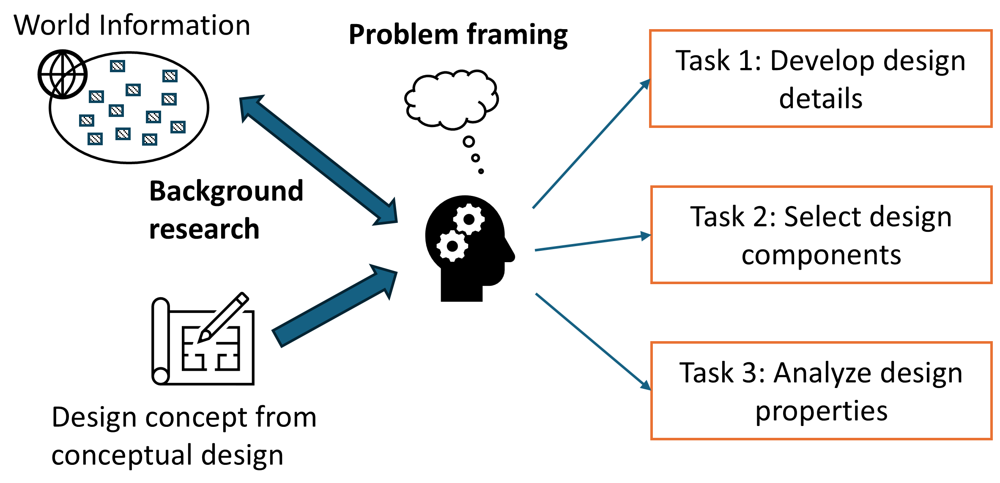
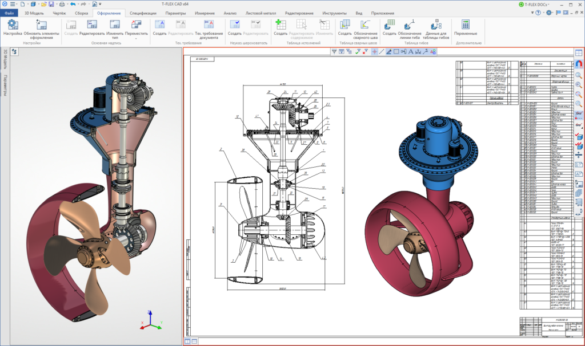
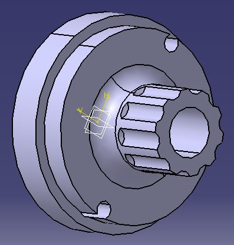
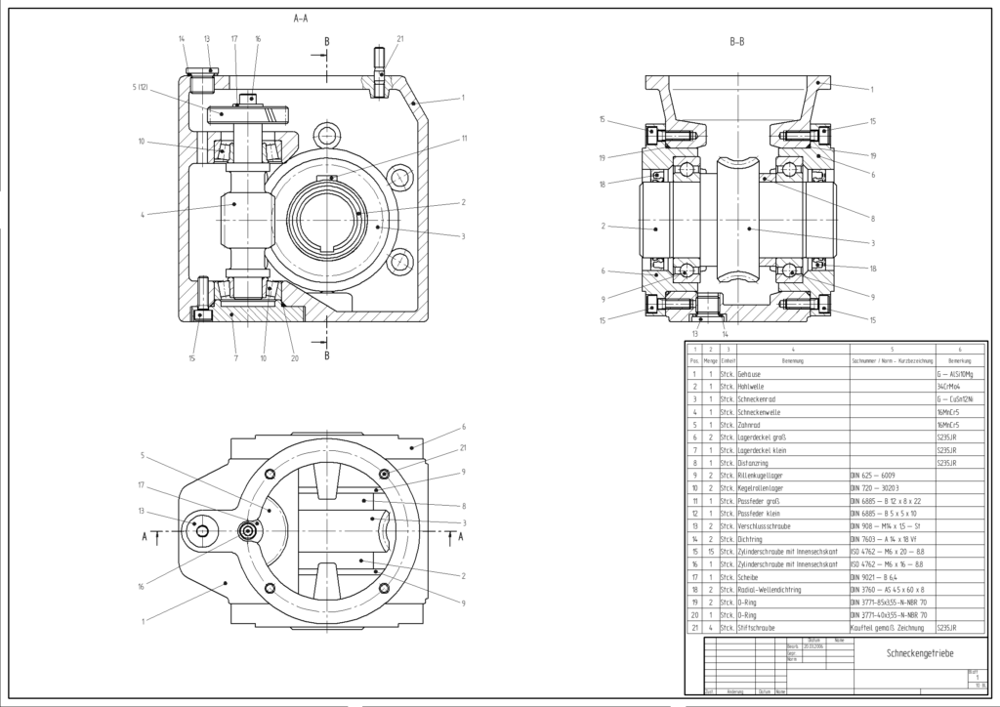
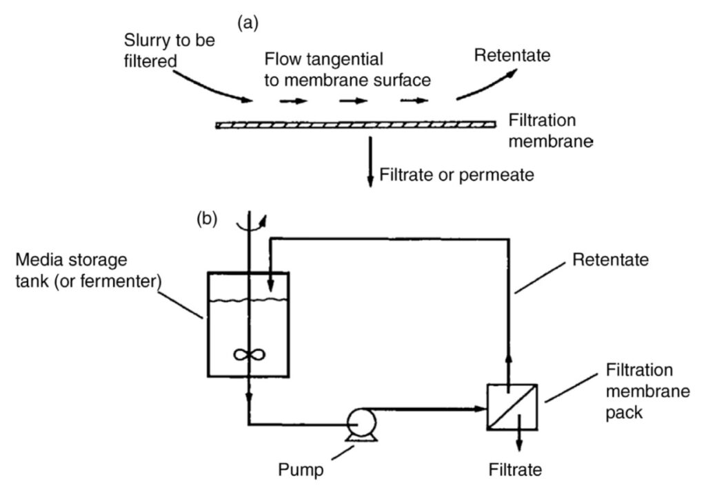
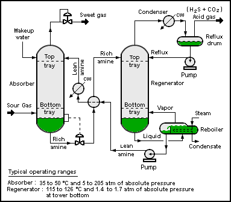
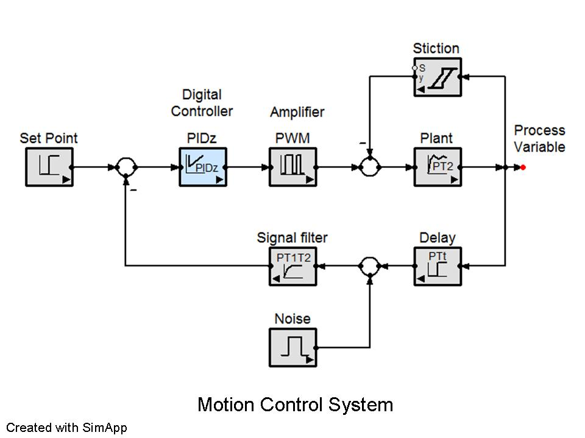
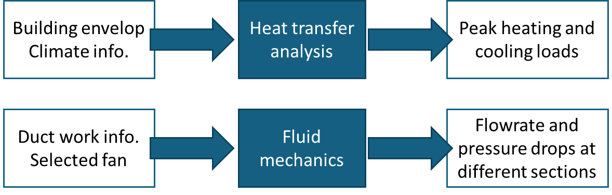
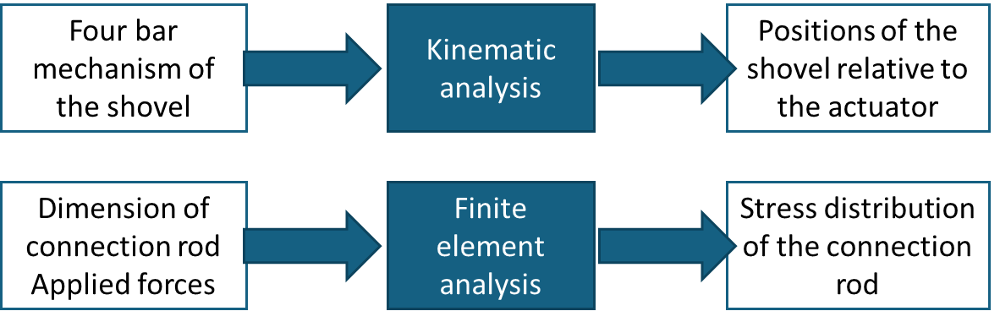

# Chapter 3: Design Development

Design development is the design stage that involves "real design work" (i.e., both the design team and the stakeholders can readily identify the design effort and accomplishments). The design team can receive more hands-on and practical design experience. Beyond the technical know-hows, the design team can also compare and reflect on the differences between the design concepts developed in conceptual design and the design details developed in design development. Such reflection can improve our conceptual design skills in the future.

## 3.1: What is the "destination" of design development?

The purpose of design development is to develop the design details for the (selected) design concept. While this definition is not difficult to understand, one practice question remains: how much design details do we need in a capstone project? This is the "destination" question that we want to answer in this section.

As a short answer, the design details should be sufficient for the design team to (1) analyze the engineering properties of the design solution and (2) verify the performance of the design solution.

In engineering practice, the gap from design solutions to the construction or production stage is huge. In a typical design project, we do not expect the design team should aim to develop design details for construction or production. Let us take two examples to explain further.

!!! example "Example: HVAC design"
    
    It is probably easy to understand that a capstone design team is not expected to build a HVAC system for a building. Yet, there can be different levels of design details that the design team can consider, listed below from high to low (or detailed) levels, for the HVAC design content.
    
    - Level 1: High-level system schematics (showing the connections between major sub-systems and components)
    - Level 2: Specifications (e.g., sizes) of major sub-systems and components
    - Level 3: Operational sequences and control
    - Level 4: Sufficient design details to conduct building energy simulation, life cycle analysis and cost analysis
    - Level 5: Construction drawings
    - Level 6: Maintenance schedules

    Notably, these levels are only approximate to illustrate the idea. Generally, the design details from Levels 1 to 4 are appropriate for a capstone project. Construction drawings contain a lot more design details that will be used by contractors to build the HVAC system on site. Maintenance schedules will depend on the actual equipment being for the HVAC system. In practice, construction drawings and maintenance schedules will take a lot of effort to develop and require domain-specific skills.
    
    Whether some design details should be included in a capstone project or not can be argued. One example is the ductwork layout and sizing, which content is close to the level of construction drawings. From the educational standpoint, the work of the ductwork layout and sizing can provide an adequate and good learning experience. Arguably, the relevant content does not affect too much the building's performance.

!!! example "Example: Snow removal design"

    Suppose that the design team is very competent. From scratch, they can make a snow removal device that can clear snow for normal conditions and operate autonomously. Yet, it is important to distinguish prototyping and production. To the stage of production (e.g., to make 100 units of the snow removal device), it will require more new design details that support the production process.

    Consider the mechanical design content for this example. There can be different levels of design details, from high to low, as listed below.
    
    - Level 1: Sketches of mechanical components and systems
    - Level 2: 3D CAD models of components and assembly
    - Level 3: Detailed 2D mechanical drawings

    Typically, the design details of Levels 1 and 2 are sufficient in a capstone project as they can effectively inform how the design solution works and support different kinds of mechanical design analysis. In contrast, it is arguable to consider whether detailed 2D mechanical drawings are needed. The purpose of this type of drawings is to inform the machinists or manufacturing staff how exactly the mechanical components should be made. It contains more manufacturing-related details such as manufacturing features (e.g., rounds versus chamfers) and tolerances.

    From the educational standpoint, making detailed 2D mechanical drawings can provide an adequate and good learning experience. Arguably, the relevant content does not affect too much the functional performance of the snow removal device.

## 3.2: What to do in design development?

Figure 1 illustrates a structure of design tasks for design development. The stage of design development starts with a design concept that was proposed from conceptual design. Then, the design team can consider three types of design tasks to further develop the design details.

- Task 1: Develop design details. Examples of design details include form and shape, parametric values, circuit boards, and codes.

- Task 2: Select design components. Examples include selection of materials, off-the-shelf components, and algorithms.

- Task 3: Analyze engineering properties. Examples include checking specifications and performance metrics, environmental analysis, and cost analysis.

Background research can support designers in conducting these design tasks. Examples include learning a new software tool, checking safety codes, and examining the product catalogs for component selection.

Problem framing in design development is about how to formulate these design tasks so that the design details are meaningful and beneficial to resolve the original design problem. One common "trap" for students is that they want to show how they know and apply knowledge from courses, where they may overlook the relevance of their work in the project's
context. We will explain more on this point in the following sub-sections for each type of design tasks.

Figure 1. Structure of design tasks in design development

## 3.3: Development of design details (Task 1)

In a design project, one important information is to inform how the final design looks like. The answer to this question varies with the level of details of the design. While the conceptual design result presents a high-level picture to capture the general idea, we need more design details to implement the design idea in practice.

The level of details required in the capstone projects vary significantly. It depends on the nature (or scope) of the project and the stakeholders' expectations. In engineering design, we can have various forms to develop and present the design details.

!!! example "Example 1: CAD models"
    
    In mechanical design, it is common to use CAD software (e.g., SolidWorks) to develop the design details. The effort to develop CAD models can be significant. Figure 2 shows a sample of an assembly model with several gears, and Figure 3 shows a sample of a component model.
    
    In practice, it can take a lot of effort to model a "simple" component. Thus, the design team should be selective in choosing important components for the capstone project. CAD models can be useful in capstone projects in the following ways.

    - To provide an overview of the "shape" of the final design to stakeholders. It is aligned with the idiom "a picture is worth a thousand words".
    - To support engineering analyses that use CAD models (e.g., finite element analysis)
    - To support 3D printing and machining

    Engineering drawings, illustrated in Figure 4, serve a different purpose than 3D CAD models. The target audience of engineering drawings are usually technical staff for the purpose of fabrication (e.g., a job request to a technician to make a mechanical component). Engineering drawings usually contain too many details for typical design communications.

Figure 2. Sample of a CAD assembly model (Source: https://commons.wikimedia.org)

Figure 3. Sample of a CAD component model (Source: https://commons.wikimedia.org)

Figure 4. Sample of an engineering drawing (Source: https://commons.wikimedia.org)

!!! example "Example 2: Process diagrams"

    Process diagrams are common to describe and explain the final design of chemical processes (e.g., filtration, refinery). Figure 5 illustrates a schematic level of a process diagram, which is proper for explanation (e.g., to explain how the process works in principle during a presentation).

    In contrast to a schematic diagram. Piping and instrumentation diagrams (P&ID) show more details of process equipment and instrumentation devices. Figure 6 shows a sample of P&ID.
    
    While both schematic diagrams and P&ID are good content for capstone projects, the design team can deliberate which diagrams are suitable in different contexts of design communications. For example, P&ID can be good in the report because the reader can take time to digest the details. In contrast, schematic diagrams can be more appropriate to communicate the design ideas in presentations or Design Fair.

Figure 5. Sample of a process diagram at a schematic level (Source: <https://commons.wikimedia.org>)

Figure 6. Sample of a P&ID (Source: <https://commons.wikimedia.org>)

!!!example "Example: Electrical and control diagrams"

    Diagrams are common in mechatronics and electrical engineering. Figure 7 shows a sample of block diagram for the control design.

Figure 7. Sample of a block diagram (Source: <https://commons.wikimedia.org>)

!!! note "Graphical information and design development"

    In engineering practice, design details are often communicated in graphical formats. Whenever it is applicable, design teams are encouraged to use graphs and diagrams to communicate their design ideas. When using graphs and diagrams, we have some guidance notes.
    
    - Engineering graphics and diagrams are specific to their own disciplines and purposes. Follow the domain-specific convention when creating graphical information.
    - With the same design solution, graphs and diagrams can convey different levels of design details. Design teams should be mindful to select an appropriate level of design details for different communication purposes. As a rule of thumb, in presentations and Design Fair, focus on sharing the design ideas using a schematic level of details (e.g., the audience can grasp the design idea by looking at the diagram for one minute). Graphs and diagrams with detailed information can be used in reports and in technical discussions.

## 3.4: Selection of design components (Task 2)

In design development, we may need to select design components (e.g., off-the-shelf components, control methods) for the final design solution or prototype. For example, in the design of the HVAC system, the design team should need to select several key components or equipment such as boilers, fans, and chiller units. In the design of the snow removal
device, the design team should need to select motors and materials of the frame.

When we plan to address a selection problem, we should consider two questions:

1. What options are available?
2. What are the criteria for the selection?

### What options are available?

We should first distinguish if we select items for the design prototype or for the paper design. Typically, the choices for the design prototype are quite limited, and they depend on:

- Prototyping resources available on campus. For example, the machine shop and procurement department often have a long-term relation with suppliers that confine what are available for the capstone projects.
- Resources provided by the project's sponsor. For example, the sponsor may ask the design team to use their motors for designing the snow removal device.

Though it may sound quite restrictive, the reality is that we cannot always get exactly what we want. Keep in mind that the design prototype is NOT the final product to the field or market. The goal of the selection can be aligned with the intent of the prototype in the capstone project.

!!! question "How about ordering items from Internet?"

    It's not a bad idea. To go for this option, the design team should consider:
    
    - Will the sponsor cover the cost?
    - Is it a shipment from a foreign country? Though the delivery time can be estimated, the actual arrival can be different. Given a short period of the capstone project, a two-week delay can be quite frustrating.
    - Is the part to be ordered critical to the project's success? If so, consider some contingency plan when the critical part does not arrive on time.
    
In paper design, the choices for the selection are theoretically unlimited. Yet, in some traditional industry (e.g., HVAC, oil & gas process), the choices are often restricted by conventions and regulations.

!!! example "Example: HVAC design -- a weak selection problem"

    Air ducts of a HVAC system are often made by galvanized steel. In theory, we can probably propose other materials (e.g., aluminum) and then run some selection process. Yet, this exercise will be viewed unnecessary because the conventional choice (galvanized steel) has been working well for many years. Alternative materials should only be considered for special design needs.

### What are the criteria for the selection?

Selection criteria have been discussed in the chapter of Conceptual Design. Ideally, some selection criteria can be related to design specifications. A good choice is received if it can satisfy all design specifications and other considerations.

Like a decision problem, we can organize the information in a decision matrix for the selection problem. Several examples are provided below.

!!! example "Example 1: Selection of packaged systems for HVAC design"

    Four selection criteria can be identified as follows.
    
    - Criterion 1: Maximum air flowrate. It is related to the capacity of the packaged system.
    - Criterion 2: Overall size. It is related to the available building space to install the packaged system.
    - Criterion 3: Supplier. We may want to know the suppliers to examine the issues of technical compatibility of the whole building system.
    - Criterion 4: Equipment cost.

    Suppose that we are considering two packaged systems. Then, we can set up a decision matrix as in Table 1. In each table's entry, we can enter the information or relative merit of two systems in view of each selection criterion (qualitatively and quantitatively). The purpose of the decision matrix is NOT to identify the winner; instead, it is only intended to show the information of comparisons in a compact format (where different stakeholders can comment the decision easily).

Table 1. Sample of a decision matrix for a selection problem

|                   | Maximum air flowrate | Overall size                        | Supplier  | Equipment cost |
| ----------------- | -------------------- | ----------------------------------- | --------- | -------------- |
| Packaged system 1 | 8,000 L/s            | Area: 1.5m×1.8m Height: 1.2m | Company A | $25,000        |
| Packaged system 2 | 10,000 L/s           | Area: 2m×2m Height: 1.5m     | Company B | $30,000        |

!!! example "Example 2: Selection of chiller units for HVAC design"
    
    Three selection criteria can be identified as follows.

    - Criterion 1: Cooling capacity. In engineering analysis, the design team should have determined the peak cooling load for the building. The peak cooling load information will be used to check the cooling capacity of the chiller units.
    - Criterion 2: Coefficient of performance (COP). It is about the energy efficiency of the chiller.
    - Criterion 3: Refrigerant. The choice of refrigerant will influence the design of pumps and piping. Also, it has a strong environmental implication.

!!! example "Example 3: Selection of fans for HVAC design"
    
    Three selection criteria can be identified as follows.
    
    - Criterion 1: Maximum flowrate. It is used to examine the airflow requirements.
    - Criterion 2: Maximum pressure rise. It is related to overcoming the pressure drops of the ductwork.
    - Criterion 3: Fan curve. It represents the profiles of pressure rise with respect to the air flowrate. It helps to understand the behaviors of the fan in part-load conditions.

!!! example "Example 4: Selection of motors for snow removal design"
    
    Two selection criteria can be identified as follows.
    
    - Criterion 1: Maximum torque. Check if the motor can provide enough push force for snow removal.
    - Criterion 2: Weight. For checking the total weight of the autonomous device

!!! example "Example 5: Selection of the frame's materials for snow removal design"
    
    Three selection criteria can be identified as follows.
    
    - Criterion 1: Strength. The yield strength of the material will influence the design of the frame.
    - Criterion 2: Manufacturability. It is related to the joining method to construct the frame.
    - Criterion 3: Weight. The frame should contribute to a noticeable portion of the total weight.

!!! note "Note: Do not trivialize selection problems"

    When the selection (or choice) can be easily made, do not formulate a selection problem and create a decision matrix. We can simply report the selection that has been made. An authentic use of decision matrix takes certain time and effort. We should only formulate the selection problems using decision matrix when the decisions involve trade-off and can influence the design outcomes substantially.

## 3.5: Analysis of design properties (Task 3)

The purpose of engineering analysis is to determine some properties related to the design idea and support the development of design details and decision making. Figure 8 illustrates the conceptual relationship between design solutions (or details) and design properties. Engineering analysis is well aligned with the applied science tradition. We should
have learned many analyses from earlier engineering courses such as:

- Analysis of force and motion (statics, kinematics, kinetics, mechanisms)
- Analysis of stress / strain and material properties
- Analysis of thermal / fluid systems (thermodynamics, fluid mechanics and heat transfer)
- Analysis of control systems (transfer function and feedback control)
- Finite element analysis (FEA)
- Computational fluid dynamics (CFD)
- Life cycle analysis (LCA)
- Cost and benefit analysis

Figure 8. Conceptual relationship between design details and design properties

Figure 9 illustrates two samples of engineering analysis for the HVAC design. After we have identified the building's location, we can know the climate information (e.g., design days). Then, by knowing the design details of the building envelope, we can calculate the peak heating and cooling loads of the building. The information can be used to size the
heating and cooling equipment. For the air distribution system, suppose that we have determined the duct size and selected the fan. We can utilize the fluid mechanics knowledge (and software tools) to determine the flowrate and pressure drops of the system.

Figure 9. Samples of engineering analysis for the HVAC design

Figure 10 illustrates two samples of engineering analysis for the snow removal design. Suppose that we have designed a four-bar mechanism for the shovel. We can then apply kinematic analysis to examine the positions of the shovel relative to the motor (or actuator). By knowing the detailed design of the connection rod, we can analyze the stress and strain properties of the connection rod using finite element analysis.

Figure 10. Samples of engineering analysis for the snow removal design

Engineering analysis is often domain specific. In the following, we list some examples of engineering analysis that are typical in capstone projects.

!!! example "Example 1: Analysis of force and motion"

    - Kinematic analysis of a robotic arm
    - Static force analysis of a walker support (to understand the risk of tipping over)

!!! example "Example 2: Analysis of stress / strain and material properties"

    - Analyze the maximum stress point of an robotic arm under the maximum loading.
    - Snow removal case: Analyze the maximum stress (value and location) of the connection rod (connecting the shovel and the robot's body).

!!! example "Example 3: Analysis of thermal / fluid systems"

    - Analysis of pressure drops of different pipe sections of a chemical process.
    - HVAC case: Analyze the peak load conditions to size the HVAC system
    - HVAC case: Analyze the annual energy consumption of the HVAC system

!!! example "Example 4: Analysis of control systems"

    - Analyze the responses of a PID controller
    - Analyze the spring-damper system for designing the suspension system

!!! example "Example 5: Finite element analysis (FEA)"

    - Analyze the distribution of stress of a landing gear due to impact forces
    - Analyze the distribution of stress of a plane's wing under different air pressures

!!! example "Example 6: Computational fluid dynamics (CFD)"

    - Analyze the distribution of temperatures of a heated surface
    - HVAC case: Analyze the distribution of smoke with the ventilation system running

!!! example "Example 7: Life cycle analysis (LCA)"

    - Compare the lifespans and embodied energy of two materials for the design
    - HVAC case: Analyze the environmental impact of a refrigerant

!!! example "Example 8: Cost and benefit analysis"

    - Estimate the implementation cost and the operation cost of a chemical process
    - HVAC case: Estimate the breakeven period of an energy-saving measure (e.g., a solar panel)

### Relevance of the chosen analysis

In the early learning process, we tend to focus on the "correctness" of the analysis. For example, we have done a lot of problem sets and checked the correct answers as the last step. No doubt. Correctness is essential. Yet, in a workplace, we normally assume that engineering graduates can do correct analyses. A practical and important challenge though is about the "relevance" of the analysis. That is, is the analysis result relevant to any design decisions and development.

!!! example "Example of irrelevant analysis (FEA)"
    
    Use FEA to identify the maximum stress point of a hand-operating handle that is made by steel. This analysis can be done correctly but the FEA result will likely have no influence to the design details. Why? Because the stress level incurred by hand operations will not likely cause the failure of the steel.

!!! example "Example of irrelevant analysis (CFD)"
    
    Use CFD to determine the flowrate of a fluid system. Normally, the average flowrate information can be estimated by a mass balance principle. CFD does not have a unique advantage to know this information, except it is more difficult to operate.

**General advice:** Engineering analysis is a good place to demonstrate the scientific competence of the design team. Yet, we should not choose to work on an analysis problem simply because we want to show people "I know how to do ABC analysis". A meaningful analysis should have some influence on the development of design details.
    
In the following, we try to provide some examples of relevant and irrelevant analyses.

!!! example "Snow removal example – Analysis of force and motion"

    - **Relevant analysis**
        - Analyze the maximum push force for the case of maximum amount to be removed
        - Analyze the tire friction and accordingly the torque requirement from the motor
    - **Less-relevant analysis**
        - Analyze the top speed of the autonomous robot when there is no snow loading.
        - Why? Well... it can be an interesting information to know. But the purpose of the snow removal robot is to remove snow. Its speed (under various conditions) is not of top concern.

!!! example "Snow removal example – Analysis of stress / strain and material properties"

    - **Relevant analysis**
        - Analyze the maximum stress (value and location) of the connection rod (connecting the shovel and the robot's body).
    - **Less-relevant analysis**
        - Compare different plastic properties for the material of the shell of the robot's body. 
        - Why? Again... it is a good academic exercise. Yet, at the early conception and prototyping stage, we will likely not put the robot's body in some extreme conditions. So some "reasonable choice" of the shell's material will likely be sufficient. After the comparison of different plastic properties, we may end up with the material that the team wants to go for initially    (without running the comparison).

!!! example "HVAC example – Analysis of thermal properties"

    - **Relevant analysis**
        - Analyze the peak load conditions to size the HVAC system
        - Analyze the annual energy consumption of the HVAC system
    - **Less-relevant analysis**
        - Analyze the strength of the duct work material.
        - Why? The duct work material is often standardized for typical applications. Such analysis can be relevant if the design situation is unique and the material's strength is critical.

## 3.6: Codes and standards as background research

Codes and standards are common in engineering practice. Sometimes they can influence how we determine the design details. Thus, the design team is encouraged to explore the relevant codes and standards as background research for the capstone project (e.g., consult the project's sponsor).

!!! example "Example: HVAC design"

    Fire codes should specify the maximum occupancy of a building. Per indoor air quality standards, the number of occupants and the type and area of a building's space should determine the minimum requirement of outdoor airflow, which will impact the fan's size, heating / cooling loads, and the energy consumption.

## 3.7: Use of GenAI in design development

GenAI is useful in search for information. In design development, GenAI can be useful for background research (e.g., codes and standards, engineering parameters, conventional design decisions). With the responses from GenAI, for important information, the design team needs to identify the original sources of the information as due diligence in engineering practice.

Keep in mind that GenAI can provide us convenient information and give us ideas for certain types of work. However, GenAI cannot replace our understanding. In teamwork, we communicate through our own understanding (i.e., we cannot communicate effectively if we essentially do not understand something). This can be considered as one boundary when we use GenAI for the design work.
