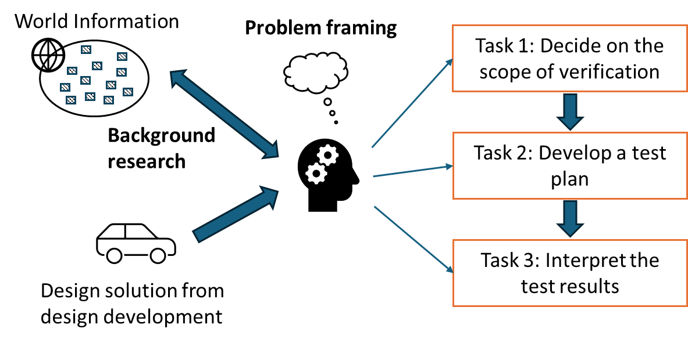

# Chapter 4: Design Verification

The stage of design verification is motivated by this question: How do we know that the final design solution is working well as intended?

While the need of design verification sounds obvious, it can be easily overlooked. For example, it can be commonly misconceived that the completion of a prototype is the destination of a capstone project. However, simply having a prototype does not imply a good design quality. More work is needed, and it is all about design verification.

In engineering practice, companies and organizations spend a lot of time and effort in design verification. Listed below are some examples.

- Biomedical: Release of a new drug (or vaccine) requires various stages of testing. These testing procedures are regulated rigorously by health organizations.
- Software: Alpha and beta testing are common to examine the quality of the software tool (or system) in view of internal developers and external users.
- Mechanical: Manufacturers need to demonstrate safety features of new vehicles through testing and show evidence that the new vehicles meet the safety standards.

Design verification should only be conducted after the design solution is completely done. In practice, design verification can be conducted by a third-party team, which is independent of the design development team. The results of design verification may lead to design modifications. Given a short 8-month period of capstone projects, the actual changes after design verification may not be practical, the design team should consider using the verification results for design recommendations.

## 4.1. Design verification and scientific practice

Whenever people talk about "design," we can easily perceive it as "subjective" activities. Surely, as designers are "human subjects," we cannot avoid some subjective nature of design activities. At the same time, we can also provide more objective ground for engineering design work so that the final design solution is not completely subjective. One aspect of it is to treat design verification as a kind of scientific practice.

In view of the tradition of scientific research, we can treat the final design solution as a scientific theory, and this "theory" tries to claim that it can solve the original design problem. No matter how beautiful a theory (or a design solution) may sound, it needs experiments (or design testing) to support its claim.

Design testing and experiments are the means to obtain observable evidence. The objective ground of observable evidence is that other people can repeat the experiments and expect to receive similar results. Observable evidence cannot "prove" the merits of a design solution; it can only be used to "argue" how well the design solution solves the design problem. In other words, we can say that design verification is an art of arguing (e.g., how capable we can present convincing observable evidence to justify the design work).

How can we develop observable evidence in design verification? Generally, there can be two main approaches: numerical analysis and physical testing, which will be discussed in subsequent sections.

## 4.2: Design verification versus validation

In a more common and rigorous use of terminology, there is a difference between verification and validation. Verification can be generally interpreted as "internal checking," mainly verifying if the design solution meets the specifications and is free from internal errors.

!!! example
    A specification states that the motion of a robotic arm from points A to B should be completed in 3 seconds. Physical experiments can be used to check if this specification can be met.

!!! example
    Software codes can be compiled without errors, and they generate expected outcomes.

Validation can be generally interpreted as "external checking," which examines if the design solution meets the needs of users.

!!! example
    Suppose that a robotic arm is intended to move parts from a CNC machine to a conveyor in a production system. One validation aspect is to examine how well this robotic arm can complete this moving task and improve the system's productivity.

!!! example
    Suppose that the software system is intended to support the check-in procedure for train passengers. One validation aspect is to examine how well the software system can reduce the average time of passengers used in the check-in procedure.

In this guide, we do not specifically differentiate the use of verification or validation in writing, and all relevant activities are labeled as design verification for simplicity. The design team is welcomed to make the distinction when they communicate their design work.

## 4.3: What to do in design verification?

Figure 1 illustrates a structure of design tasks for design verification. The stage of design verification starts with a design solution that was developed from design development. Then, the design team can consider these three types of design tasks procedurally to develop observable evidence for design verification.

- Task 1: Decide on the scope of verification. Design verification can demand a lot of effort. The design team needs to prioritize their aims of verification given limited time and resources.
- Task 2: Develop a test plan. A test plan should outline and explain how the design team plans to conduct design testing or experiments.
- Task 3: Analyze the verification results. This can involve statistical analysis to inform test results and draw conclusions.

Background research can support designers in conducting these design tasks. Examples include learning new prototyping techniques and experimental procedures, checking regulations related to design testing, and exploring benchmark performance related to similar design solutions.

Problem framing in design verification is about how to plan for these design tasks so that observable evidence about the quality of the design solution can be collected and examined in an organized manner.

Figure 1. Structure of design tasks in design verification

## 4.4: Decide on the scope of verification (Task 1)

What is the target information that we want to collect during design verification? We can start our thinking back to conceptual design: What specifications and performance metrics have we defined during conceptual design? Accordingly, we can start to plan the scope of design verification by considering the following.

- Physical properties (e.g., does the design solution meet the specifications?)
- Design functions (e.g., do the design functions work as intended?)
- Performance metrics (e.g., how well the design solution is performing?)

!!! example "Example: HVAC design"

    As the design team is not expected to build the HVAC system, the verification effort will primarily focus on technical analysis.
    
    - On physical properties, the design team can check some core specifications such as equipment capacities versus load requirements. Cost analysis can be conducted to estimate if the HVAC system can be implemented within the budget. Environmental analysis can be conducted to estimate the energy consumption and carbon emission from system operations.
    - On design functions, the design team may skip this aspect as we do not identify relevant functions that can be verified in this project's context.
    - On performance metrics, if some equipment or measures (e.g., new energy control) are designed in the HVAC system, the design team can consider energy consumption (or energy use intensity, EUI) and carbon emission as target performance metrics. Another possible choice can be the breakeven period (e.g., increased initial cost versus saved  operational cost).

!!! example "Example: Snow removal device"

    Suppose that the design team does not plan to build the whole snow removal device due to the time constraint. The verification effort can focus on technical analysis and physical testing.
    
    - On physical properties, the design team can check some core specifications such as the weight and size of the core system and the motor's torque and efficiency.
    - On design functions, the design team can build some partial systems (or sub-systems) to demonstrate and examine some core functions. One function is to remove snow without autonomous features. Another function is to track a given path autonomously without the snow removal function. Another function is to avoid a planned obstacle  autonomously.
    - On performance metrics, the design team can measure the efficiency of the snow removal function (e.g., time required to remove a given amount of snow). The design team can also measure the efficacy of the autonomous features by checking how well the device can work around predefined, difficult conditions on their own.

The design team is encouraged to take the "close-the-loop" perspective. That is, as conceptual design has thoroughly identified the design specifications and performance metrics, the effort of design verification is to check the design solution based on what have been discussed in conceptual design.

While it is attempting to verify and test "everything," our time and resources will simply not allow us to do so. Thus, a more practical perspective is to consider (1) the value of observable evidence for design verification and (2) the effort and resources required to obtain the piece of observable evidence. A good case will be about having a relevant piece of observable evidence (e.g., most stakeholders want to see this information) that can be obtained with manageable efforts and resources.

!!! example "Example: HVAC design (trade-off example)"

    The design team has a chance to receive a heat-recovery device donated by a company. As one option for design verification, the design team can try to operate this device and observe how energy saving can be achieved by using this device. However, by doing so, the design team does not have enough time to prepare and run building energy simulation. By choosing between (1) physical testing of a heat-recovery device and (2) building energy simulation, we would suggest going for building energy simulation because such verification work speaks directly to the purpose of the design project.
    
    Of course, the choice is not completely exclusive (i.e., the design team does not have to choose one of the two). The design team can shift their work effort, e.g., 70% for energy simulation and 30% for physical testing. One message of this example is to explain how to stay focused on the purpose of design verification when allocating work effort to different tasks.

!!! example "Example: Snow removal design (trade-off example)"
    
    The design team has two pathways for design verification. In pathway #1, the design team can build an integrated system and demonstrate how the device moves autonomously on a dry ground. In pathway #2, the design team can build and demonstrate two systems that perform the snow-removal function and the autonomous function, respectively. By choosing between these two pathways, we would suggest going for pathway #2 because the primary purpose of the project is snow removal. In pathway #1, the outcome can be perceived as building an autonomous vehicle, where the snow-removal function is not apparent.
    
    Of course, the design team does not have to choose one of the two, and they shift the work to balance the verification effort between the snow removal and autonomous functions. Just in mind: While it is fascinating to show the autonomous function, it can be a big miss without showing the snow removal function clearly in design verification. Also, the design team can try to prepare the verification content so that the sponsoring company can see how to continue this design and development work.

## 4.5: Develop a test plan (Task 2)

A test plan can outline and explain the tasks for design verification so that team members and stakeholders can work together for the common goal. Suppose that the design team has identified the general scope of design verification for their project (i.e., Task 1 in [Section 4.4](chapter_4_design_verification/#44-decide-on-the-scope-of-verification-task-1)). At a high level, a test plan needs to answer three questions:

- Question 1: How does the design team plan to obtain observable evidence, simulation and/or prototyping?
- Question 2: What should we consider when planning for prototyping?
- Question 3: How many tests or experiments that the design team plan to conduct for design verification?

### Question 1: Simulation or prototyping?

Simulation can be interpreted as numerical experiments, which rely on the applications of engineering knowledge and scientific principles to evaluate the quality of the design solution. In practice, it is common to use software tools to support simulation activities (e.g., EnergyPlus for HVAC systems and Simulink for control systems).

While simulation is often applied to time-based dynamic systems (i.e., how things change over time), the notion of "numerical experiments" can also be applied to other types of numerical analysis. For example, life-cycle analysis (LCA) can be used to examine the carbon emission (or other environment impacts) from the design solution. Finite-element analysis (FEA) can be used to examine the structural integrity of a physical construct.

In design verification, prototyping can be referred to the use of physical prototypes to evaluate the quality of the design solution. Physical prototype is often perceived as a "golden standard" in design as it stands for a real object to be operated in the physical world. However, building a physical prototype requires a good amount of time and effort. The design team should be mindful to the verification purpose when they plan to build their physical prototype.

Table 1 summarizes the pros and cons of simulation and prototyping. Apparently, it depends on the project's context and goal to decide on which approach to use for design verification. Generally, simulation is cheaper and safer, and thus it can support the investigation of "what-if" scenarios more promptly. On the other side, prototyping can provide empirical results (usually perceived as more "authentic") related to the physical world, but it tends to take more time and effort to develop.

Table 1. Comparison of simulation and prototyping

|             | Pros                                                                                                                              | Cons                                                                                                                           |
| ----------- | --------------------------------------------------------------------------------------------------------------------------------- | ------------------------------------------------------------------------------------------------------------------------------ |
| Simulation  | - Less effort, more economical  - Flexible on resources  - Allow more testing scenarios  - Chance to learn simulation software tools | - Less “authentic” results, which are based on theories and principles  - Numerical models cannot capture all empirical factors |
| Prototyping | - Empirical results that are valuable in view of “real world” performance  - Hands-on experience for managing and building stuff   | - Resource-intensive (e.g., material cost, equipment) and time-consuming  - Need to coordinate with others to access resources  |

!!! example "Example: HVAC design"

    While it is expected to use building energy simulation as the major approach in design verification, the simulation results are considered appropriate if they are within 10% errors of the "real results". Since building operations are subject to several uncertain factors (e.g., weather, occupancy), the "real results" from empirical data change very often.

!!! example "Example: snow removal design"

    While we can simulate the autonomous function on a computer screen, the perception of trustworthiness of the design outcome is not equivalent to demonstrations through physical prototypes.

### Question 2: What to consider when planning for prototyping?

The most important consideration is to evaluate whether the design team can secure the required resources and have enough time to develop physical prototypes. In this aspect, capstone projects are not different from design projects in companies. Even a company has certain resources (e.g., materials, equipment, lab facility) that can support design work, it does not mean that those resources are freely available for the design team whenever they want. The design team is expected to have good communication and management skills to work with relevant stakeholders and plan for the prototyping process.

In prototyping, one common question is how to get the parts or sub-systems for the physical prototype. Typically, we can have three approaches.

- Buy the parts from the market.
    - Off-the-shelf parts usually have reasonable quality, and the design team can save the making effort. Need to pay attention of the lead
    time between ordering and arrival.
- Make the parts by the design team.
    - The design team can have more flexibility to customize the parts, and they can gain hands-on experience. Craftmanship may be needed, and it usually takes more time and effort.
- Outsource the making of the parts to a machine shop.
    - The design team can access more prototyping resources and professionals. How to communicate the fabrication requirements can be challenging. Also, need to pay attention to the lead time.

The use of 3D printing is also so common in practice. Generally, 3D printing can support the design team to get physical parts rapidly and economically, and thus it can support design iterations, where designers can try and improve different design ideas. When considering the use of 3D printing, we can keep the following notes in mind.

- 3D-made parts are often restricted to certain materials. They are good to demonstrate the form-and-fit type of functions but not good for the design aspects related to material strength.
- They are also limited by dimensional accuracy (related to tolerance in mechanical design) and the quality of surface finishing.
- If the same component can be made by 3D printing or purchased through stock parts, it is often better to simply use stock parts.

To some design teams, prototyping is attractive because it can enrich hands-on learning experience, and finished prototypes can clearly demonstrate design intelligence and effort. Yet, in engineering practice, we do not develop prototypes merely for the show-and-tell reason. Instead, we make prototypes to serve the design verification purpose. That is, if there is no apparent reason for design verification, the design team should re-consider whether they should proceed to making physical prototypes.

In prototyping, it is common to have a gap between what the design team wants and what the reality can offer. For example, a resource is anticipated to support prototyping or physical testing, but it becomes unavailable when needed. While this situation is unfortunate, keep in mind that physical prototypes are only a means to design verification, and they are not the only means. The design team can still be flexible to consider other available resources and adjust the plan for design verification.

!!! example "Example: HVAC design (fall short of the expectation)"

    The design team has a chance to receive a heat-recovery device donated by a company. After some planning, the design team decides to run physical experiments with the device as part of their design work. However, the delivery of the device is delayed so that the original plan cannot be conducted before the end of the semester. The design team can still document their preparation work (e.g., design of instrumentations and execution plans) so that another design team can continue the work.

!!! example "Example: Snow removal design (priority in prototyping)"

    As the snow removal function is essential, the design team aims to develop a physical prototype for this function alone with wired electricity and control. At the same time, another prototype is built to examine the autonomous function.

### Question 3: How many tests for design verification?

When we do design testing, we want to inform how well the proposed design solution is working. We can classify three types of design testing.

_Type 1: Verify the design specifications_

While design specifications are set at the earlier time, it is good to verify if the design solution truly meets these specifications. Generally, we do not need to check all specifications but only the key ones.

_Type 2: Examine the design functions_

This can be done by demonstrations. We want to check if the design solution works as intended in various conditions.

_Type 3: Measure the performance metrics_

Beyond "simply working", we should check how well the design is working. This aspect can be examined by measuring the performance metrics of the prototype.

!!! example "Example: HVAC design"

    The design team can organize these three types of testing as follows.
    
    - Testing type 1: Specifications
        - Check if the design is below the specified budget or initial cost.
    - Testing type 2: Functions
        - Check (via simulation) how the heat pump works under normal winter conditions.
        - Check (via simulation) how the heating system works under extreme cold conditions.
    - Testing type 3: Performance metrics
        - Check (via simulation) the energy use intensity (EUI).
        - Check (via simulation) the annual carbon emissions.

!!! example "Example: Snow removal design"

    The design team can organize these three types of testing as follows.
    
    - Testing type 1: Specifications
        - Check if the weight of the device is below the specified value.
    - Testing type 2: Functions
        - Check (via physical testing) how the device removes snow under normal snow conditions.
        - Check (via physical testing) how the device achieves several autonomous tasks.
    - Testing type 3: Performance metrics
        - Check (via physical testing) the efficiency and effectiveness of snow removal tasks.

For good practices in design verification, we often need to "repeat" tests to address two types of variability: (1) operating conditions and (2) randomness. Operating conditions are referred to the environmental parameters under which the design solution is operated. They can be applied to the cases of simulation and physical testing. In contrast, randomness is referred to uncontrollable variations of the outcomes from testing, and it is mostly relevant to physical testing[^1] in the context of capstone design projects.

!!! example "Example: HVAC design (operating conditions)"

    Building energy simulation usually takes the weather data of a "typical year" which can generate the results for typical situations. In the simulation study, the design team defines the following less-typical operating conditions to examine the performance of the HVAC design.
    
    - Extreme cold conditions: Check the heating function under the extreme conditions, as well as the energy performance.
    - Low-occupancy conditions: The building is not always full of occupants. The design team may want to examine one energy saving measure during the low-occupancy conditions.

!!! example "Example: Snow removal design (operating conditions and randomness)"

    The design team plans to test the snow removal function. Since it is difficult to control the snow conditions, the design team gets a flat surface (5m × 5m), on which they can put artificial snow. The snow removal device can be tested on this flat surface. Two operating conditions can be defined as follows.

    - 3-cm snow condition: Considered as a typical scenario, the design team checks the time for the device to remove snow. The snow removal task will be repeated for three times to examine the variation of the outcomes (i.e., related to randomness).
    - 10-cm snow condition. Considered as an extreme scenario, the design team wants to check whether the device can remove this amount of snow. The task will not be repeated (i.e., a type of stress test without considering repeatability and randomness).

In response to the question "how many tests?", it depends on how many operating conditions and how many repeated tests to examine randomness that the design team wants to work on. Since possible numbers of tests can be numerous, the design team should be careful in defining what tests should be considered for their design verification purpose.

## 4.6: Interpret the test results (Task 3)

After executing the test plan, we will have a set of data as test results. The test results will not speak for their own "naturally" in response to the verification inquiry (e.g., how well the design solution performs). For checking the specifications and design functions, the analysis and interpretation can be as straightforward as indicating the Yes/No answer (e.g., can the HVAC system offer enough heat during extreme cold conditions and can the snow removal device remove 3-cm snow). If the list of specifications and design functions is long, the design team can use a table to organize the information.

The performance metrics of the design solution can be analyzed and compared in three different situations.

- When the tests have been run under various operating conditions, the design team can compare the test results across different operating conditions.
- Compare the test results with some benchmarks that express the typical performance of similar existing designs.
- In view of randomness, the design team can report the range (or standard deviation) of performance under repeated tests (or experiments).

!!! example "Example: HVAC design (benchmarking)"
    
    For the metric of energy use intensity (EUI), the design team can compare its result with the national EUI benchmark and justify whether the HVAC design is more energy efficient. The design team can compare the percentage of increase of EUI in the "normal conditions" (heat pump efficiency involved) and the "extreme conditions" (heat pump efficiency removed).
    
    Concerning carbon emissions, the design team can analyze a "conventional" HVAC system and obtain its values of carbon emission as a benchmark. Then, the design team can compare how much carbon emission can be reduced from their proposed HVAC system.

!!! example "Example: Snow removal example (benchmarking and variation)"

    Suppose that the design team uses time to measure the efficiency of a preset snow removal task. While there is no similar device on the market, one benchmark is to experiment how much time a typical person would take to do the same snow removal task. Then, the design team can indicate how much efficient of their design solution to remove snow as compared to human operators.
    
    Concerning variations, the design team can repeat the snow removal task three times and report the longest and shortest times. It can inform that the stability of the design's performance. In addition, the design team can compare the times between the standard task (3-cm snow) and the stress-test task (10-cm snow). It can inform how well the snow removal device performs under various depths of snow.

[^1]: We can examine the effects of randomness via simulation (e.g., Monte Carlo simulation), but it is not common in the scope of capstone projects.
