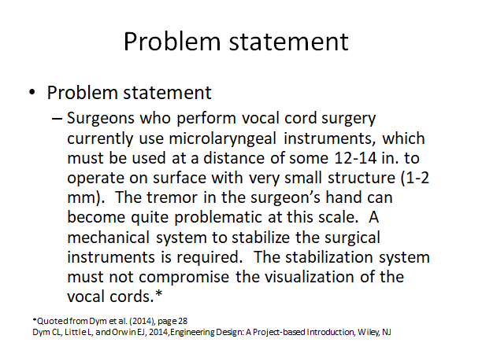
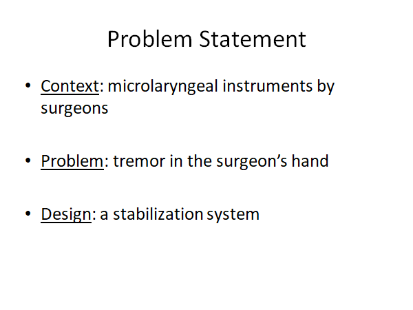
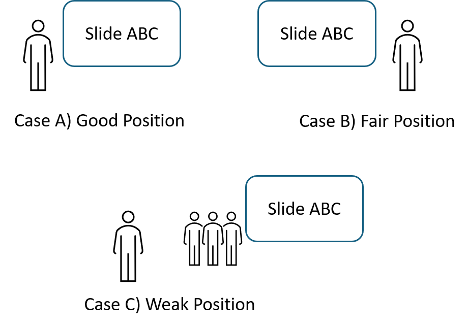

# Chapter 6: Design Communication

The importance of design communication is evident; stakeholders cannot appreciate the work if the design solution cannot be communicated effectively. In capstone projects, design communication can be difficult because:

- There are different types of audience, who have different expectations to the design project. Effective communication requires us to tailor the design information for different types of audience.
- Some design projects are technically challenging. It is then not easy to communicate the technical content to non-technical audience.

This guide will discuss some common forms of communication for engineering design projects:

- Design report
- Presentation
- Progress review
- Design fair
- Poster and video

## 6.1. Design report

Consider that the duration of a capstone project is two school semesters, and the design team is expected to submit a report by the end of each semester (i.e., interim report and final report). Here we can discuss some general expectations for these two types of reports.

Interim reports are prepared at the midpoint of the capstone project. To demonstrate the design progress, the interim reports should be able to address the following questions.

- What is the project's motivation? Any significance?
- How does the proposed design solution work in principle?
- What is the plan for the second half of the capstone project?

For final reports, the design team should aim to write one report for the whole project. In view of stakeholders, it is more natural and effective to document the whole project in a single report. Thus, the design team can "repeat" some content from the interim report (e.g., introduction, design concept). Some additional content should address the following questions.

- What are the design details that demonstrate the design effort?
- How do the team verify the design solution? What are the verification results?
- Any design recommendations and conclusions?

For both interim and final reports, the design team should also include the content related to project management such as the role of each team member, the project's budget and expenses, the progress's progress and schedule. The intent is to inform the high-level project information so that the readers can grasp the picture about how the whole project operates.

Design report is a formal technical document. There are few basic rules that should be considered when preparing this document.

- Sections and sub-sections should be numbered properly. That helps readers to track the organization of the document.
- The font style and size should be applied consistently. Inconsistency can leave an unprofessional impression.
- Figures and tables should be numbered properly. They should also be explicitly mentioned and referred to in the main text (otherwise, why then putting these figures and tables in the first place).
- References should be used and cited properly. Improper use of references can lead to a concern of plagiarism.

!!! question "Use of GenAI in technical writing?"
    
    Here we skip the discussion of whether we "should" use Generative AI (GenAI) in report writing. Instead, we want to highlight some aspects when the design team plans to use GenAI in their report writing.
    
    - When GenAI has been used in the capstone project, the design team needs to declare how GenAI is used in the design reports. This has gradually become a professional requirement. While GenAI can be used in technical work, stakeholders want to know and distinguish how GenAI was used in the development of the content.
    - Since GenAI can quickly generate a lot of content related to the project, it can be attempting of the design team to fill in such information. Note that stakeholders are interested in how well the design team can solve the problem. Having too much AI-infused content can reduce the quality of the design reports.

## 6.2. Presentation

In capstone projects, the design team may be required to do several presentations to different stakeholders. We suppose that the format of each presentation session begins with a presentation of 15 to 20 minutes and followed with a question-and-answer (Q&A) period.

When preparing a presentation, we should keep two factors in mind: (1) the time limit and (2) the target audience. In both schools or workplaces, running over in presentation is not appropriate (or unprofessional), and we should avoid it even by cutting the content (during the speech). In contrast to design reports, the target audience of design presentations tend to be more diverse (especially when the presentation session is handled as a social event that welcomes different stakeholders and interested parties). Altogether, one challenge for the design team is to organize the presentation content to help diverse audience understand the project in a relatively short time.

As the design team has worked so hard for the capstone project, they tend to organize too much content, making the presentation choppy (e.g., switching speakers frequently) and difficult to follow. One open question to consider is: How much information can a person comprehend in 15-20 minutes? Reflected from our personal experience, it would not be a lot. Speaking faster would not help because it is limited by the cognitive capacity of a typical person. In addition, unlike reading, the audience cannot go back or rewind the content that they do not understand. All these explain the communication challenges in presentations.

To address the communication challenges, we suggest the design team to focus on "what the target audience want to know" instead of "what I want or need to say". Then, try to communicate the "big picture" rather than or before the technical details. The big-picture content includes the design's motivation, the overall design concept (or solution), and the verification evidence. Once the audience can grasp the big picture, they can follow up the technical details during the Q&A.

### Slides

As we often use slides for presentation, the quality of slides is important. Consider a sample slide (Figure 1) below.

Figure 1. Sample slide 1

How would you comment this slide? Yes, it is informative. Yet, I would say that not many people want to read it (or why should I read paragraphs from slides during a presentation?). Thus, one tip is to make a good use of bullet points, which can structure the content in a more readable format. Check below for a revised slide (Figure 2) below.

Figure 2. Sample slide 2

------------------------------------------------------------------------

The revision technique here is to break down the problem statement into three aspects (i.e., context, problem and design). The presentation talk can then provide relevant details, while the slide can remind the audience the general picture. Another tip is to avoid complete sentences on the slide because we want the audience to pay attention to the speech.

Also, pay attention to the font style. Font styles can be generally classified into (1) serif font (e.g., Time New Roman) and (2) sans serif font (e.g., Arial). Generally, people may prefer sans serif font because it tends to provide cleaner visual effects (i.e., easier for people to read it from a distance). Similar to report writing, the font style should be consistent throughout the presentation.

Readability of the slides is another consideration. First, the font size should not be too small (depending on the size of the room and the projection screen). Also, the color rendering through a projector or a big TV is often not as good as what we see from a computer screen. So try to avoid small color contrast and high details of pictures.

Of course, don't forget to use figures and tables to communicate ideas. Especially in engineering design, drawings, CAD models and schematics can be helpful to explain the design ideas.

### Speeches

During presentations, speeches are usually more important than slides, which are considered as "visual aids". That is, slides are supposed to support the presenter's speech. The audience can understand the content better if they can easily connect the visual content from the slide and the audio content from the speech. Thus, one advice for the presenter is to refer to the special portion of the slide that is related to their current speech (e.g., interact with the slide rather than just talk directly from the cue card). Ideally, the presenter can keep the eye contact with the audience occasionally during the speech.

Where should the presenter stand relative to the slide? Figure 3 illustrates three cases. Case A is good, as the presenter stands from the left side of the slide (in view of the audience). Since English is read from left to right, it is more natural for the audience to hear the voice from the left side when reading from the slide. Case B is less ideal, but it is still appropriate (especially when the physical space does not allow Case A). In Case C, other team members are standing between the presenter and the slide (it could happen when the design team is nervous in rotating presenters). This situation is certainly not ideal, and the design team should take the time to switch the positions of different speakers.

Figure 3. Position of the presenter

### Q&A

After the presentation, we often have a question-and-answer (Q&A) period. We have a few tips for the design team to handle this Q&A period.

- Don't be too defensive. The Q&A period is not a thesis defence. Very often, when the audience ask questions, they want to understand something that they do not get during the presentation (e.g., clarification question) or they want to learn the rationale of some   design decision or approach (e.g., justification question). In the end, the main duty of the design team is to explain, and they do not have to "prove" who is right or wrong. In capstone projects, the design team and the audience do not need to agree with each other.

- It's OK to say "we don't know." Not knowing something is not a deficiency immediately (it depends on the context and situation). Even in the case that the design team does not know something that is obvious to the project's context, admitting the deficiency is a good gesture to move forward.

- In case of any "negative" discussions, the design team does not need to "argue" on the spot, and they can talk to the instructor after for the advice.

## 6.3. Progress review

Design reports and presentations are more outward facing, where the target readers and audience can be diverse. In contrast, progress reviews are intended for the inner-circle (or academic) stakeholders such as academic advisors and teaching assistants. They are typically used to examine the project's progress and provide timely feedback.

Due to the inner-circle nature, except for the first meeting, we can assume that the audience of progress reviews know the project's background and the ongoing project work. While the format of progress reviews can be flexible, the design team can consider the following agenda to organize the progress review meetings (of course some details can be adjusted per the project's nature and the stakeholders' preferences).

- Start with the update of the project's progress (around 10 minutes). If it has been a while since the last meeting (e.g., more than 1 month), it is good to have an overview to remind the audience.
- Discuss the update of project management (e.g., next tasks and milestones, update of team members' roles) (around 5 minutes)
- Facilitate the question and answer (Q&A) period.
- The design team can prepare questions and seek for advice from the progress review meetings. Sample questions include the following.
    - Is the design solution appropriate?
    - Should we skip the deliverable of Drawing XYZ (which can take a lot of time to prepare)?
    - Should we do the computational analysis for this project. It seems difficult. If it's needed, how should we do this analysis?

Both presentations and progress reviews have a similar format: presentation first and then Q&A period. Yet, the purposes are different. Design presentations should be more formal as they mark the important stages of the design project (e.g., interim and final), and the content should be more summative. In contrast, progress reviews are intended to be informative, where academic advisors and teaching assistants can provide timely feedback (before the formal assessments such as reports and presentations).

## 6.4. Design fair

Design fair is an event that showcases the design capstone projects to the public. In this section, we will discuss some communication tips with general visitors and design demonstrations.

The frequently asked question (FAQ) in design fair should be "what is your project about?". So the design team should prepare the answer accordingly. It is preferred to start with a short answer. Then provide more details according to the responses of the visitor.

Different from "presenting," some visitors may want to know some specific information. So listen carefully during the conversations. Also, the environment can be noisy (a common situation for a public event). It is better to speak slowly and keep the eye contact.

Design demonstration (demo) sounds easy to do. But we may not do it effectively to deliver good messages. Consider the following scenarios of design demo.

- Scenario 1: "I am going to pass the design around."
- Scenario 2: "I am showing that the design can do XYZ."
- Scenario 3: "You now can see that our design can do a better job than other designs."

Scenario 1 is OK as the audience can have some hands-on experience with the design. However, it is somewhat passive. The design team can be more active to show the merits of the design solution.

Thus, Scenario 2 is considered better. Note that "do XYZ" can be interesting and meaningful tasks rather than the basic functions of the design. For example, to demonstrate a newly designed drone, it may be better to show how it can do the delivery duty (e.g., deliver pizza?) rather than just show its flying functions.

Scenario 3 is challenging to do, and it is about benchmarking and improvement in engineering and business. Yet, if it can be done, it can likely impress the visitors.

What if the design demo does not work on the spot? First, it should be a teamwork moment. The design team should have some member to do the "rescue." At the same time, let some members keep the communication with the visitors. Keep in mind that the visitors are mostly interested in "the message" more than just the design demo. If the rescue fails, the design team can still use the prototype and help the visitors to imagine how the design works. The key message is to convince the visitors that the design solution is a good idea (even though it does not work in the design demo).

## 6.5. Poster and video

Compared to reports and presentations, posters and videos are different communication means that are intended for a wider and more diverse group of audience. They tend to take less time for the audience to grasp and appreciate the design idea. To this context, the design team can mainly focus on three questions in the preparation of the content for posters and videos.

- What is the design problem?
- How does the design solution work?
- Any evidence showing that the design solution works?

Poster should be self-contained that explains the key content of the design project. For a general visitor, they may initially take 30 seconds to "read" (or screen) the poster. So it is good to design the poster so that people can grasp the basic idea of the design project quickly. Here are few tips for consideration.

- Use of point forms, tables and pictures (rather than paragraphs)
- Divide the whole poster into few sections (use of frames and colors) so that people can easily grasp the structure of the content.
- Remember people that tend to read from top to bottom, from left to right. Arrange the content accordingly to guide the reading flow.
- Poster is only a starting point. A good poster can engage discussions between the design team and the visitors.

Video is a newer (less traditional?) form of technical communications. To the context of a capstone design project, the video's length should be around 2-3 minutes. The video should have minimal technical barriers in a way that it can be understood by non-technical audience. The video can be played during the design fair to engage the visitors. It can also be ready to show on smartphones in other occasions (e.g., job interview).

While it is common to upload videos on social media or video sharing sites (e.g., YouTube), we need to be careful sometimes in video sharing. We have few tips below for consideration.

- Be professional. Design is a professional activity in engineering. Also, the video represents our university to the outside.
- Make an interesting video. Being professional does not mean "boring." People like interesting stuff. Consider "interesting stuff" as a means to engage, but they are not an end of the message.
- Realize the unique advantage of video (in comparison to static pictures). Try to use more dynamic visuals in explanations and demonstrations.
- Be sensible to the privacy information (related to persons and companies).
